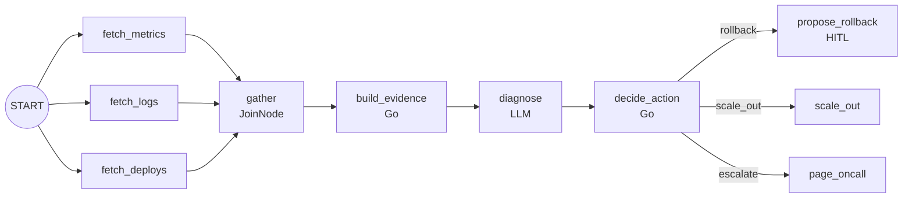

こんにちは。[ジェダイパンくず☁️](https://x.com/jedipunkz) です。

2026年6月30日に [ADK (Agent Development Kit) for Go の 2.0](https://developers.googleblog.com/announcing-adk-go-20/) がリリースされました。目玉は「グラフベースのワークフローエンジン」で、エージェントアプリケーションを**ノードとエッジのグラフとして記述する**という方向に大きく舵を切っています。

自分がこのリリースで一番興味を持ったのは、公式サンプルの `examples/workflow/routing/llm/` に書かれていたこのコメントでした。

```go
// This is the canonical "LLM as the brain, engine does the routing" pattern.
```

LLM は「脳」であって「ルータ」ではない、分岐そのものはエンジン（＝決定的なコード）が担う、という設計思想です。これは SRE のインシデント対応エージェントを考える上でかなり本質的な話に見えたので、リポジトリを実際に clone して公式サンプルを読み、さらに自分でインシデントトリアージのワークフローを書いてビルド・実行するところまでやってみました。

この記事は以下の三本柱で構成します。

1. ADK の基本（そもそも ADK でエージェントをどう書くのか）
2. 2.0 の新機能（グラフワークフローエンジンを中心に）
3. SRE Agent における応用（実際に動くコードを書いてみた）

なお、記事中のコードはすべて [google/adk-go](https://github.com/google/adk-go) の実際のサンプルか、自分で書いて `go vet` とビルド・実行を通したものです。

## ADK の基本

### インストール

2.0 からモジュールパスが `google.golang.org/adk/v2` に変わりました。Go 1.25 以上が必要です。

```bash
go get google.golang.org/adk/v2
```

### 最小のエージェント

ADK の世界観は「エージェント = モデル + 指示 + ツール」です。公式の `examples/quickstart/main.go` がその最小形です。

```go
model, err := gemini.NewModel(ctx, "gemini-flash-latest", &genai.ClientConfig{
	APIKey: os.Getenv("GOOGLE_API_KEY"),
})
if err != nil {
	log.Fatalf("Failed to create model: %v", err)
}

a, err := llmagent.New(llmagent.Config{
	Name:        "weather_time_agent",
	Model:       model,
	Description: "Agent to answer questions about the time and weather in a city.",
	Instruction: "Your SOLE purpose is to answer questions about the current time and weather in a specific city. You MUST refuse to answer any questions unrelated to time or weather.",
	Tools: []tool.Tool{
		geminitool.GoogleSearch{},
	},
})
if err != nil {
	log.Fatalf("Failed to create agent: %v", err)
}

config := &launcher.Config{
	AgentLoader: agent.NewSingleLoader(a),
}

l := full.NewLauncher()
if err = l.Execute(ctx, config, os.Args[1:]); err != nil {
	log.Fatalf("Run failed: %v\n\n%s", err, l.CommandLineSyntax())
}
```

登場人物を整理すると以下です。

| 要素 | 役割 |
|------|------|
| `model` | LLM のバックエンド。Gemini 以外も差し替え可能 |
| `llmagent.Config.Instruction` | いわゆるシステムプロンプト |
| `Tools` | エージェントが呼べる関数群 |
| `launcher` | CLI (`console`)、Web UI、REST サーバなどの実行形態を提供するランナー |

`full.NewLauncher()` は便利で、同じバイナリを `console` で起動すればターミナル対話、`web` で起動すれば Dev UI が立ち上がります。エージェントのロジックと実行形態が分離されているのが Go らしいところです。

### ツールを自分で書く

ツールは Go の関数をそのまま登録できます。`examples/tools/multipletools/main.go` から抜粋します。

```go
type Input struct {
	LineCount int `json:"lineCount"`
}
type Output struct {
	Poem string `json:"poem"`
}
handler := func(ctx agent.Context, input Input) (Output, error) {
	return Output{
		Poem: strings.Repeat("A line of a poem,", input.LineCount) + "\n",
	}, nil
}
poemTool, err := functiontool.New(functiontool.Config{
	Name:        "poem",
	Description: "Returns poem",
}, handler)
```

入出力の JSON Schema は Go の型から自動生成されます。ここが Python 版と比べたときの Go 版の気持ちよさで、ツールの引数スキーマを手で書く必要がありません。

ここまでが 1.x 系から変わらない「ADK の基本」です。ここから 2.0 の話に入ります。

## 2.0 の新機能

### グラフワークフローエンジン

2.0 の中心は `workflow` パッケージです。アプリケーションを「ノードをエッジでつないだグラフ」として宣言し、スケジューラが実行します。

最小の例が `examples/workflow/basic/main.go` です。

```go
// 1. Define functions for nodes
upperFn := func(ctx agent.Context, input string) (string, error) {
	if input == "" {
		return "No input received", nil
	}
	return strings.ToUpper(input), nil
}

suffixFn := func(ctx agent.Context, input string) (string, error) {
	return input + " IS AWESOME!", nil
}

// 2. Create Nodes
nodeConfig := workflow.NodeConfig{
	RetryConfig: workflow.DefaultRetryConfig(),
}
nodeA := workflow.NewFunctionNode("upper", upperFn, nodeConfig)
nodeB := workflow.NewFunctionNode("suffix", suffixFn, nodeConfig)

// 3. Define flow (Edges)
edges := workflow.Chain(workflow.Start, nodeA, nodeB)

// 4. Create Workflow Agent
myWorkflow, err := workflowagent.New(workflowagent.Config{
	Name:        "simple_sequence_workflow",
	Description: "Converts string to uppercase and appends a suffix",
	Edges:       edges,
})
```

注目したいのは `NewFunctionNode` がジェネリクスで、**ノードの入出力の型が Go の関数シグネチャからそのまま推論される**点です。`upperFn` は `string` を受けて `string` を返すので、このノードの入力型・出力型は `string` になります。グラフのつなぎ間違いがある程度型で守られます。

このワークフロー全体が `workflowagent.New` で「1つのエージェント」になるので、`launcher` に渡す使い方は quickstart とまったく同じです。

### ノードの種類

2.0 では用途別にノードのコンストラクタが用意されています。実際にリポジトリの `workflow/` 配下を grep すると以下が確認できます。

| コンストラクタ | 用途 |
|---------------|------|
| `NewFunctionNode` | Go の関数をノード化。型推論が効く |
| `NewEmittingFunctionNode` | イベントを自分で emit できる。ストリーミングや分岐、HITL に使う |
| `NewAgentNode` | `LlmAgent` などのエージェントをノード化 |
| `NewToolNode` | ツールをそのままグラフの1ステップにする |
| `NewJoinNode` | fan-in の同期バリア |
| `NewDynamicNode` | 実行順序を Go のコードとして書く動的オーケストレーション |
| `NewWorkflowNode` | サブワークフローを1ノードとして埋め込む |
| `NewParallelWorker` | リスト入力に対して並列に実行 |

### ルーティング：LLM に全部やらせない

ここが個人的に一番刺さった部分です。冒頭に挙げた `examples/workflow/routing/llm/main.go` を見ていきます。

このサンプルは、ユーザの発言を question / statement / exclamation に分類して、それぞれ別のハンドラに振り分けます。LLM に渡されるプロンプトはこれだけです。

```go
const classifierInstruction = `Classify the user's message into one of three categories:
- "question": ends with '?' or asks for information
- "exclamation": expresses strong emotion, often ends with '!'
- "statement": a neutral declarative sentence

Answer with EXACTLY one word, lowercase, no punctuation: question, exclamation, or statement.`
```

LLM の仕事は「1単語を返す」ことだけです。**どこに分岐するかは LLM に決めさせません**。分岐はこの下流のノードが決定的に行います。

```go
// routeByClassification turns the classifier's one-word output into a
// routing event; returning nil suppresses the default terminal event.
func routeByClassification(ctx agent.Context, input any, emit func(*session.Event) error) (any, error) {
	// Normalise defensively in case the LLM ignored the one-word
	// instruction; off-script replies fall through to "statement".
	category := strings.TrimRight(strings.ToLower(strings.TrimSpace(fmt.Sprint(input))), ".")
	if category != "question" && category != "exclamation" && category != "statement" {
		category = "statement"
	}
	ev := session.NewEvent(ctx, ctx.InvocationID())
	ev.Routes = []string{category}
	if err := emit(ev); err != nil {
		return nil, err
	}
	return nil, nil
}
```

そしてグラフのエッジ側で、ルート値と遷移先の対応を静的に宣言します。

```go
edges := workflow.Concat(
	workflow.Chain(workflow.Start, classifyNode, routeNode),
	[]workflow.Edge{
		{From: routeNode, To: question, Route: workflow.StringRoute("question")},
		{From: routeNode, To: statement, Route: workflow.StringRoute("statement")},
		{From: routeNode, To: exclamation, Route: workflow.StringRoute("exclamation")},
	},
)
```

この構造の何が良いかというと、

- LLM が指示を無視して "this is a question" などと返しても、`routeByClassification` の正規化で `statement` にフォールバックする。**壊れ方が予測可能**になる
- グラフを見れば「起こりうる遷移の全集合」が読める。LLM が勝手に未知の状態に飛ぶことがない
- ルーティングのロジックが Go の関数なので、LLM 抜きで単体テストできる

ちなみに `Route` インタフェースの実装はこれだけです。エッジは「イベントに付いた `Routes` に自分の値が入っているか」しか見ません。

```go
type Route interface {
	Matches(event *session.Event) bool
}

func matchRoute(routeValue string, event *session.Event) bool {
	for _, v := range event.Routes {
		if v == routeValue {
			return true
		}
	}
	return false
}
```

`StringRoute` のほかに `IntRoute`、`BoolRoute`、複数値をまとめて受ける `MultiRoute[T]` があります。`examples/workflow/routing/int/` ではサイコロの目 1〜10 を `MultiRoute[int]{1, 2, 3}` のようにレンジで振り分けています。

そして重要なのは、**分類そのものに LLM が要らないなら使わなくていい**ということです。同じ構造で LLM を完全に外した `examples/workflow/routing/string/` が用意されていて、`classifyAndRoute` の中身は単なる Go の switch です。

```go
trimmed := strings.TrimSpace(msg)
switch {
case strings.HasSuffix(trimmed, "?"):
	return "question"
case strings.HasSuffix(trimmed, "!"):
	return "exclamation"
default:
	return "statement"
}
```

グラフの形は LLM 版とまったく同じで、判断主体だけが差し替わっています。「この判断は LLM が要るのか、要らないのか」をノード単位で選べる。これが 2.0 の設計で一番効いている部分だと思います。

### fan-out / fan-in（並列とバリア）

`examples/workflow/complex/main.go` は3つのリサーチャーエージェントを並列に走らせ、`JoinNode` で待ち合わせて統合します。

```
START ─┬─> RenewableEnergyResearcher ─┐
       ├─> EVResearcher ──────────────┼─> gather ─> format ─> SynthesisAgent
       └─> CarbonCaptureResearcher ───┘   (Join)   (func)      (LLM)
```

エッジの定義は `EdgeBuilder` の fluent API で書けます。

```go
eb := workflow.NewEdgeBuilder()
eb.AddFanOut(workflow.Start, renewableNode, electricVehicleNode, carbonNode)
eb.AddFanIn(gatherNode, renewableNode, electricVehicleNode, carbonNode)
eb.Add(gatherNode, formatNode)
eb.Add(formatNode, synthNode)
```

`JoinNode` は全ての先行ノードが終わってから1回だけ発火し、後続に `map[ノード名]出力` を渡します。受け取る側はこうなります。

```go
func formatSummaries(_ agent.Context, gathered map[string]any) (string, error) {
	sections := []struct{ label, key string }{
		{"Renewable Energy", renewableResearcher},
		{"Electric Vehicles", electricVehicleResearcher},
		{"Carbon Capture", carbonResearcher},
	}
	// ...
}
```

サンプルのコメントに「マップを range せず固定スライスを回すことでプロンプトを決定的に保つ」と書かれているのが細かいですが良いです。並列実行の結果をそのまま LLM に食わせると順序が非決定になるので、ここも決定的なコードで整形しています。

### Human-in-the-Loop

2.0 では任意のノードが実行を止めて人間の入力を要求できます。しかもこの中断はプロセス再起動を跨いで復帰できます（セッション履歴から再構成される）。

再開モードは2種類あります。

- **handoff**: 人間の回答が次のノードの入力として流れる（`RerunOnResume: &false`。nil の場合もエンジンは現状 handoff として扱う）
- **re-entry**: 中断したノードが最初から再実行され、回答は `ResumedInput` から読める（`RerunOnResume: &true`）

re-entry パターンが `examples/workflow/hitl_rerun/main.go` です。`ResumeOrRequestInput` が「1回目は質問して中断、2回目は回答を返す」を1つの呼び出しにまとめてくれます。

```go
rerun := true
greet := workflow.NewEmittingFunctionNode[any, any]("greet",
	func(nc agent.Context, _ any, emit func(*session.Event) error) (any, error) {
		reply, err := workflow.ResumeOrRequestInput(nc, emit, session.RequestInput{
			InterruptID: "ask_name-" + nc.InvocationID(),
			Message:     "What's your name?",
		})
		if err != nil {
			return nil, err
		}

		name, _ := reply.(string)
		if name == "" {
			name = "stranger"
		}
		return fmt.Sprintf("Hello, %s!", name), nil
	},
	workflow.NodeConfig{RerunOnResume: &rerun},
)
```

実装は拍子抜けするほど素直です。

```go
func ResumeOrRequestInput(ctx agent.Context, emit func(*session.Event) error, req session.RequestInput) (any, error) {
	if reply, ok := ctx.ResumedInput(req.InterruptID); ok {
		return reply, nil
	}
	if err := emit(NewRequestInputEvent(ctx, req)); err != nil {
		return nil, err
	}
	return nil, ErrNodeInterrupted
}
```

`InterruptID` に `nc.InvocationID()` を混ぜているのがポイントで、これは同一実行内では安定して回答を対応付けられる一方、実行ごとにはユニークになるためです。ここを固定文字列にすると Dev UI が「その ID はもう回答済み」と判断して次回以降プロンプトを出さなくなります。ソースのコメントにわざわざ書いてあるので、実際に踏んだ人がいるのでしょう。

### 動的オーケストレーション

グラフを静的に宣言するのではなく、実行順序を Go のコードとして書きたい場合は `NewDynamicNode` を使います。

```go
myWorkflow := workflow.NewDynamicNode[string, string]("greeter_workflow",
	func(nc agent.Context, in string, _ func(*session.Event) error) (string, error) {
		return workflow.RunNode[string](nc, greeterNode, in)
	},
	workflow.NodeConfig{},
)
```

`workflow.RunNode` で任意のノードをその場で呼べます。for ループや if 分岐をそのまま書けるので、静的グラフでは表現しづらい制御フローはこちらに逃がせます。動的ノードは既定で `RerunOnResume=&true` なので、HITL と組み合わせるとオーケストレータの本体が頭から再実行され、回答は `nc.ResumedInput(...)` で拾う形になります。

### リトライとタイムアウト

`NodeConfig` にスケジューラレベルの信頼性設定が入りました。

```go
type NodeConfig struct {
	ParallelWorker bool
	RerunOnResume  *bool
	WaitForOutput  *bool
	RetryConfig    *RetryConfig
	Timeout        time.Duration
	EmitsOwnSpan   bool
}
```

`RetryConfig` は `MaxAttempts` / `InitialDelay` / `MaxDelay` / `BackoffFactor` / `Jitter` / `ShouldRetry` を持つフラットな構造体です。推奨は `DefaultRetryConfig()` を起点に上書きする書き方で、構造体リテラルで作ると未設定フィールドがゼロ値（＝リトライなし）になるので注意、とドキュメントに明記されています。

```go
rc := workflow.DefaultRetryConfig()
rc.MaxAttempts = 10
cfg := workflow.NodeConfig{RetryConfig: rc}
```

### そのほかの改善と破壊的変更

グラフエンジン以外では以下が入っています。

- **`agent.Context` の統一**: これまで別物だった `ToolContext` と `CallbackContext` が1つの `agent.Context` に統合されました
- **LlmAgent のモード**: `ModeChat` / `ModeTask` / `ModeSingleTurn` の3つ。既定値はサブエージェントとしては `ModeChat`、ワークフローのノードとしては `ModeSingleTurn` になります。つまり `NewAgentNode` で包んだ LLM エージェントは、チャット履歴ではなく**先行ノードの出力を入力として消費する**モードになります
- **テレメトリの一貫性**: 単体エージェントでもグラフでも同じ span ツリーになる

破壊的変更としては [README-v2.md](https://github.com/google/adk-go/blob/main/README-v2.md) に以下が挙がっています。

1. モジュールパスが `google.golang.org/adk/v2` に変更
2. `session.NewEvent` が第1引数に `context.Context` を要求するようになった

```go
// Before
ev := session.NewEvent(ctx.InvocationID())
// After
ev := session.NewEvent(ctx, ctx.InvocationID())
```

これはイベント ID とタイムスタンプを `platform` パッケージ経由で取得するようになったためで、`platform.WithTimeProvider` などを ctx に載せることで**決定的でリプレイ可能なイベント**を作れるようになっています。ワークフローエンジンが再開可能である以上、必然の変更に見えます。

3. コンテキスト統合に伴い、テストのモックが壊れる。手で足りないメソッドを生やす代わりに `agent.StrictContextMock` を埋め込む方法が推奨されています。未実装メソッドを呼ぶと黙ってゼロ値を返さず panic するので、想定外の呼び出しがテストで顕在化します

```go
type fakeContext struct {
	agent.StrictContextMock
}

var _ agent.Context = (*fakeContext)(nil)
```

## SRE Agent における応用

ここからが本題です。前置きした「LLM は脳、ルーティングはエンジン」という思想が、SRE のインシデント対応エージェントにどう効くのかを考えます。

### なぜこの分割が SRE で効きそうなのか

以前 [Google が提唱する AI in SRE とは何か](/post/ai-sre-google/) という記事で、SRE 自律性の5段階モデル（L0〜L4）を紹介しました。L2 は「AI が実行前に人間の明示的承認を必要とする」段階、L3 は「十分に定義されたシナリオで AI が独立実行する」段階です。

このモデルを実装に落とすときに困るのが、**「十分に定義されたシナリオ」をどこに書くのか**という問題です。全部プロンプトに書いて LLM に任せると、

- 同じアラートで毎回違う判断をする可能性がある（＝再現性がない）
- 「このエージェントは何をしうるのか」をレビューできない
- 昇格ゲート（L2→L3）の判定に必要な統計を取るにも、そもそも判断の分布が安定しない

という状態になります。インシデント対応で本番環境に変更を加える以上、ここは譲れないところです。

ADK Go 2.0 のグラフは、この境界を**構造として**引けます。

- **LLM がやること**: 大量の非構造データ（ログ、メトリクス、変更履歴）を読んで所見を書く
- **Go のコードがやること**: どの Runbook を実行するか決める、承認を挟むか決める

そして実行しうる操作の全集合はグラフのエッジとして静的に宣言されているので、コードレビューで確認できます。

### インシデントトリアージのワークフローを書いてみた

実際に書いてみました。以下は `go vet` を通し、実際に実行して動作確認したコードです（LLM 部分をスタブに差し替えた版で end-to-end の動作を確認しています）。

グラフはこうなります。



ポイントは、**LLM ノード `diagnose` は分岐の手前にいるが、分岐の判断材料ではない**ことです。`decide_action` は LLM の出力ではなく、`build_evidence` が session state に保存した生の証拠データを読んで決めます。

まず証拠を集めるフェーズ。外部 API を叩くのでリトライとタイムアウトを付けます。

```go
fetchCfg := workflow.NodeConfig{
	RetryConfig: workflow.DefaultRetryConfig(),
	Timeout:     15 * time.Second,
}
metricsNode := workflow.NewFunctionNode(nodeMetrics, fetchMetrics, fetchCfg)
logsNode := workflow.NewFunctionNode(nodeLogs, fetchLogs, fetchCfg)
deploysNode := workflow.NewFunctionNode(nodeDeploys, fetchDeploys, fetchCfg)
```

`fetchMetrics` などは普通の Go 関数です。実運用では Cloud Monitoring や Prometheus を叩く場所になります。

```go
type Metrics struct {
	ErrorRate     float64 `json:"errorRate"`
	LatencyP99Ms  int     `json:"latencyP99Ms"`
	CPUSaturation float64 `json:"cpuSaturation"`
}

func fetchMetrics(_ agent.Context, service string) (Metrics, error) {
	// 実運用では Cloud Monitoring / Prometheus を叩く
	return Metrics{ErrorRate: 0.18, LatencyP99Ms: 2400, CPUSaturation: 0.42}, nil
}
```

3つの収集を並列に走らせて `JoinNode` で待ち合わせ、`build_evidence` で1つの構造体にまとめます。ここで **session state に生データを保存しておく**のが後で効きます。

```go
func buildEvidence(ctx agent.Context, gathered map[string]any) (string, error) {
	ev := Evidence{Service: "checkout-api"}
	var err error
	if ev.Metrics, err = decodeInto[Metrics](gathered[nodeMetrics]); err != nil {
		return "", fmt.Errorf("decoding metrics: %w", err)
	}
	if ev.Logs, err = decodeInto[LogDigest](gathered[nodeLogs]); err != nil {
		return "", fmt.Errorf("decoding logs: %w", err)
	}
	if ev.Deploy, err = decodeInto[DeployInfo](gathered[nodeDeploys]); err != nil {
		return "", fmt.Errorf("decoding deploys: %w", err)
	}

	// 決定ノードが後から読めるように state に置く。LLM の出力ではなく
	// この生データが、あとで分岐を決める唯一の根拠になる。
	if err := ctx.State().Set(stateEvidence, ev); err != nil {
		return "", fmt.Errorf("saving evidence: %w", err)
	}

	b, err := json.MarshalIndent(ev, "", "  ")
	if err != nil {
		return "", err
	}
	return "Incident evidence:\n" + string(b), nil
}
```

LLM には診断だけをさせます。ここで **「アクションを提案するな」と明示している**のが今回の肝です。

```go
diagnoser, err := llmagent.New(llmagent.Config{
	Name:        "diagnose",
	Model:       model,
	Description: "summarises incident evidence for a human responder",
	Instruction: "Given the incident evidence, write at most three sentences describing the " +
		"most likely cause. Do not propose an action; the runbook is chosen elsewhere.",
})
```

そして決定ノード。これが全体で一番重要な部分です。

```go
func decideAction(ctx agent.Context, diagnosis any, emit func(*session.Event) error) (any, error) {
	raw, err := ctx.State().Get(stateEvidence)
	if err != nil {
		return nil, fmt.Errorf("reading evidence: %w", err)
	}
	ev, err := decodeInto[Evidence](raw)
	if err != nil {
		return nil, fmt.Errorf("decoding evidence: %w", err)
	}

	// ポリシーは全て決定的な Go のコード。LLM の所見はイベントに載せて
	// 人間に見せるが、分岐の判断には使わない。
	var route string
	switch {
	case ev.Deploy.MinutesSinceDeploy <= 30 && ev.Metrics.ErrorRate > 0.05:
		route = routeRollback
	case ev.Metrics.CPUSaturation > 0.85 && ev.Metrics.ErrorRate <= 0.05:
		route = routeScaleOut
	default:
		route = routeEscalate
	}

	out := session.NewEvent(ctx, ctx.InvocationID())
	out.Routes = []string{route}
	out.Output = ev
	out.Content = &genai.Content{Parts: []*genai.Part{{
		Text: fmt.Sprintf("decision=%s\nLLM diagnosis: %v", route, diagnosis),
	}}}
	if err := emit(out); err != nil {
		return nil, err
	}
	return nil, nil
}
```

`diagnosis`（LLM の出力）は引数で受け取っていますが、`switch` の条件には**一切登場しません**。人間に見せるためにイベントの `Content` に載せるだけです。「デプロイから30分以内でエラー率が5%を超えていたらロールバック」という判断は、LLM の気分ではなくコードが決めます。この関数は `agent.Context` のモックさえ用意すれば LLM 抜きで単体テストできますし、閾値を変えたときの影響もレビューできます。

エッジの定義は `EdgeBuilder` で書きます。`AddRoutes` を使うとルート値と遷移先の対応がマップで一望できます。

```go
eb := workflow.NewEdgeBuilder()
eb.AddFanOut(workflow.Start, metricsNode, logsNode, deploysNode)
eb.AddFanIn(gatherNode, metricsNode, logsNode, deploysNode)
eb.Add(gatherNode, evidenceNode)
eb.Add(evidenceNode, diagnoseNode)
eb.Add(diagnoseNode, decideNode)
eb.AddRoutes(decideNode, map[string]workflow.Node{
	routeRollback: rollbackNode,
	routeScaleOut: scaleNode,
	routeEscalate: escalateNode,
})
```

### 承認ゲートを HITL で表現する

ロールバックは本番に変更を加えるので、L2（実行前に人間の承認が必要）として承認を挟みます。`ResumeOrRequestInput` の re-entry パターンをそのまま使えます。

```go
func proposeRollback(ctx agent.Context, ev Evidence, emit func(*session.Event) error) (string, error) {
	reply, err := workflow.ResumeOrRequestInput(ctx, emit, session.RequestInput{
		InterruptID: "approve_rollback-" + ctx.InvocationID(),
		Message: fmt.Sprintf("Roll back %s to the previous release? (deploy %s, %d min ago, error rate %.1f%%) [yes/no]",
			ev.Service, ev.Deploy.LastDeployID, ev.Deploy.MinutesSinceDeploy, ev.Metrics.ErrorRate*100),
	})
	if err != nil {
		return "", err
	}
	if answer, _ := reply.(string); answer != "yes" {
		return "rollback declined by operator; escalating to on-call", nil
	}
	return fmt.Sprintf("rolled back %s from %s", ev.Service, ev.Deploy.LastDeployID), nil
}
```

```go
rerun := true
rollbackNode := workflow.NewEmittingFunctionNode("rollback", proposeRollback,
	workflow.NodeConfig{RerunOnResume: &rerun})
```

自律性レベルがノードの `NodeConfig` として表現できる、というのがきれいだと思いました。L2 のまま運用したいノードには HITL を挟み、統計が溜まって L3 に上げられると判断したらそのノードから HITL を外す。**昇格が設定変更として表現できる**わけです。逆に「このノードはまだ L2」というのがコード上で一目で分かります。

さらに、この中断はプロセス再起動を跨いで復帰できます。深夜のインシデントで承認待ちのままエージェントのプロセスが死んでも、セッション履歴から状態を再構成して続きから再開できる、というのは運用上そこそこ大きい話です。

### 実行結果

スタブ版を実際に動かした出力です。

```
Agent -> decision=rollback
LLM diagnosis: STUB DIAGNOSIS for:
Incident evidence:
{
  "service": "checkout-api",
  "metrics": {
    "errorRate": 0.18,
    "latencyP99Ms": 2400,
    "cpuSaturation": 0.42
  },
  "logs": {
    "topErrors": [
      "panic: nil map write",
      "context deadline exceeded"
    ],
    "volume": 18342
  },
  "deploy": {
    "lastDeployId": "rel-2026-07-31.3",
    "minutesSinceDeploy": 7
  }
}
Agent -> Roll back checkout-api to the previous release? (deploy rel-2026-07-31.3, 7 min ago, error rate 18.0%) [yes/no]
User -> yes
Agent -> rolled back checkout-api from rel-2026-07-31.3
```

fan-out での並列収集、Join での待ち合わせ、state 経由での証拠の受け渡し、決定的なルーティング、HITL による中断と再開が一通り動いています。

### 応用を考えるうえで気になっている点

いくつか、まだ自分の中で答えが出ていないところを正直に書いておきます。

**閾値をどこで管理するか。** 上の `decideAction` は閾値がハードコードされています。実際には「サービスごとにエラー率の閾値が違う」「エラーバジェットの消費速度で判断したい」という話になるので、ポリシーは外部設定に出したくなります。ただし外部設定にすると今度は「レビューできる」という利点が薄れる可能性があり、どこで線を引くかは考えどころです。

**LLM を判断に使いたくなる領域は必ずある。** 「デプロイ直後にエラー率が上がった」は決定的に書けますが、「複数サービスにまたがる連鎖障害の起点はどこか」は決定的に書けません。前者は Go、後者は LLM、という分割は理屈では分かるのですが、実際のインシデントはその中間にあるものが多いです。この場合、LLM に判断させたうえで**その判断を実行前にコードで検証する**（提案されたアクションがホワイトリストに入っているか、blast radius が閾値以下か）という二段構えになるのかもしれません。グラフで書くなら「LLM ノード → 検証ノード（Go）→ ルーティング」という形です。

**動的ノードとのバランス。** インシデント対応は「調べて、分からなかったらもう少し調べる」という反復が本質なので、完全に静的なグラフでは表現しきれない部分があります。`NewDynamicNode` で調査ループを書き、確定した対処だけを静的グラフに戻す、というハイブリッドが現実解な気がしていますが、そうすると動的ノードの中身が結局ブラックボックスになるジレンマがあります。

このあたりは実際に運用してみないと分からないので、もう少し手を動かしてみるつもりです。

## まとめ

ADK Go 2.0 のグラフワークフローエンジンを、公式サンプルを読みながら追いかけてみました。

- ADK の基本は「モデル + 指示 + ツール」で、Go の型からツールのスキーマが自動生成されるのが気持ちいい
- 2.0 の中心はグラフワークフローエンジン。ノードとエッジで書き、fan-out / fan-in / 条件分岐 / HITL / リトライがフレームワーク側の機能になった
- ルーティングは LLM ではなくエンジンが行う。LLM は分類結果を1単語返すだけで、どこに飛ぶかはエッジの静的な宣言で決まる
- この分割は SRE のインシデント対応エージェントにそのまま効きそう。「LLM は診断、Go は判断」に分けると、実行しうる操作がレビューでき、判断が再現でき、自律性レベルがノード設定として表現できる

「LLM に全部任せない」というのは一見後退に見えますが、本番環境に手を入れるエージェントを作る文脈では、むしろこれが前に進むための条件だと思います。LLM に任せる範囲を絞れば絞るほど、その範囲について統計が取れて、安心して自律度を上げられる。ADK Go 2.0 のグラフは、その「絞る」作業をフレームワークの構造として支援してくれている、というのが読んでみた感想でした。

## 参考

- [Announcing ADK Go 2.0](https://developers.googleblog.com/announcing-adk-go-20/)
- [google/adk-go](https://github.com/google/adk-go)
- [ADK Go v2.0.0 Release](https://github.com/google/adk-go/releases/tag/v2.0.0)
- [ADK Go 2.0 migration guide (README-v2.md)](https://github.com/google/adk-go/blob/main/README-v2.md)
- [ADK Documentation](https://google.github.io/adk-docs/)
- [Google が提唱する AI in SRE とは何か](/post/ai-sre-google/)
