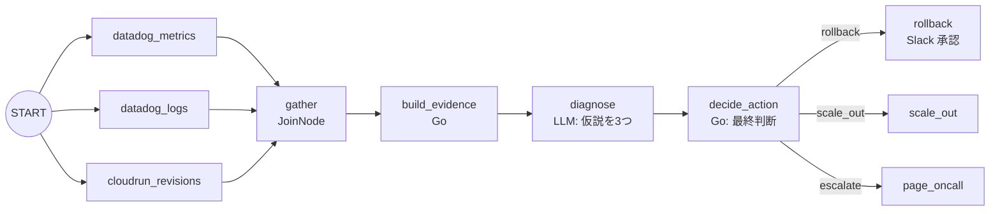

こんにちは。[ジェダイパンくず☁️](https://x.com/jedipunkz) です。

2026年6月30日に [ADK (Agent Development Kit) for Go の 2.0](https://developers.googleblog.com/announcing-adk-go-20/) がリリースされました。目玉は「グラフベースのワークフローエンジン」で、エージェントアプリケーションを**ノードとエッジのグラフとして記述する**という方向に大きく舵を切っています。

自分がこのリリースで一番興味を持ったのは、公式サンプルの `examples/workflow/routing/llm/` に書かれていたこのコメントでした。

```go
// This is the canonical "LLM as the brain, engine does the routing" pattern.
```

LLM は「脳」であって「ルータ」ではない、分岐そのものはエンジン（＝決定的なコード）が担う、という設計思想です。これは SRE のインシデント対応エージェントを考える上でかなり本質的な話に見えたので、リポジトリを実際に clone して公式サンプルを読み、さらに自分でインシデントトリアージのワークフローを書いてビルド・実行するところまでやってみました。観測は Datadog、デプロイ先は Google Cloud Run、承認は Slack という構成にしています。

この記事は以下の三本柱で構成します。

1. ADK の基本（そもそも ADK でエージェントをどう書くのか）
2. 2.0 の新機能（グラフワークフローエンジンを中心に）
3. SRE Agent における応用（Datadog / Cloud Run / Slack で実際に動くコードを書いてみた）

なお、記事中のコードはすべて [google/adk-go](https://github.com/google/adk-go) の実際のサンプルか、自分で書いて `go vet` とビルド・実行を通したものです。

## ADK の基本

### インストール

2.0 からモジュールパスが `google.golang.org/adk/v2` に変わりました。Go 1.25 以上が必要です。

```bash
go get google.golang.org/adk/v2
```

### 最小のエージェント

ADK の世界観は「エージェント = モデル + 指示 + ツール」です。公式の `examples/quickstart/main.go` がその最小形です。

```go
model, err := gemini.NewModel(ctx, "gemini-flash-latest", &genai.ClientConfig{
	APIKey: os.Getenv("GOOGLE_API_KEY"),
})
if err != nil {
	log.Fatalf("Failed to create model: %v", err)
}

a, err := llmagent.New(llmagent.Config{
	Name:        "weather_time_agent",
	Model:       model,
	Description: "Agent to answer questions about the time and weather in a city.",
	Instruction: "Your SOLE purpose is to answer questions about the current time and weather in a specific city. You MUST refuse to answer any questions unrelated to time or weather.",
	Tools: []tool.Tool{
		geminitool.GoogleSearch{},
	},
})
if err != nil {
	log.Fatalf("Failed to create agent: %v", err)
}

config := &launcher.Config{
	AgentLoader: agent.NewSingleLoader(a),
}

l := full.NewLauncher()
if err = l.Execute(ctx, config, os.Args[1:]); err != nil {
	log.Fatalf("Run failed: %v\n\n%s", err, l.CommandLineSyntax())
}
```

登場人物を整理すると以下です。

| 要素 | 役割 |
|------|------|
| `model` | LLM のバックエンド。Gemini 以外も差し替え可能 |
| `llmagent.Config.Instruction` | いわゆるシステムプロンプト |
| `Tools` | エージェントが呼べる関数群 |
| `launcher` | CLI (`console`)、Web UI、REST サーバなどの実行形態を提供するランナー |

`full.NewLauncher()` は便利で、同じバイナリを `console` で起動すればターミナル対話、`web` で起動すれば Dev UI が立ち上がります。エージェントのロジックと実行形態が分離されているのが Go らしいところです。

### ツールを自分で書く

ツールは Go の関数をそのまま登録できます。`examples/tools/multipletools/main.go` から抜粋します。

```go
type Input struct {
	LineCount int `json:"lineCount"`
}
type Output struct {
	Poem string `json:"poem"`
}
handler := func(ctx agent.Context, input Input) (Output, error) {
	return Output{
		Poem: strings.Repeat("A line of a poem,", input.LineCount) + "\n",
	}, nil
}
poemTool, err := functiontool.New(functiontool.Config{
	Name:        "poem",
	Description: "Returns poem",
}, handler)
```

入出力の JSON Schema は Go の型から自動生成されます。ここが Python 版と比べたときの Go 版の気持ちよさで、ツールの引数スキーマを手で書く必要がありません。

ここまでが 1.x 系から変わらない「ADK の基本」です。ここから 2.0 の話に入ります。

## 2.0 の新機能

### グラフワークフローエンジン

2.0 の中心は `workflow` パッケージです。アプリケーションを「ノードをエッジでつないだグラフ」として宣言し、スケジューラが実行します。

最小の例が `examples/workflow/basic/main.go` です。

```go
// 1. Define functions for nodes
upperFn := func(ctx agent.Context, input string) (string, error) {
	if input == "" {
		return "No input received", nil
	}
	return strings.ToUpper(input), nil
}

suffixFn := func(ctx agent.Context, input string) (string, error) {
	return input + " IS AWESOME!", nil
}

// 2. Create Nodes
nodeConfig := workflow.NodeConfig{
	RetryConfig: workflow.DefaultRetryConfig(),
}
nodeA := workflow.NewFunctionNode("upper", upperFn, nodeConfig)
nodeB := workflow.NewFunctionNode("suffix", suffixFn, nodeConfig)

// 3. Define flow (Edges)
edges := workflow.Chain(workflow.Start, nodeA, nodeB)

// 4. Create Workflow Agent
myWorkflow, err := workflowagent.New(workflowagent.Config{
	Name:        "simple_sequence_workflow",
	Description: "Converts string to uppercase and appends a suffix",
	Edges:       edges,
})
```

注目したいのは `NewFunctionNode` がジェネリクスで、**ノードの入出力の型が Go の関数シグネチャからそのまま推論される**点です。`upperFn` は `string` を受けて `string` を返すので、このノードの入力型・出力型は `string` になります。グラフのつなぎ間違いがある程度型で守られます。

このワークフロー全体が `workflowagent.New` で「1つのエージェント」になるので、`launcher` に渡す使い方は quickstart とまったく同じです。

### ノードの種類

2.0 では用途別にノードのコンストラクタが用意されています。実際にリポジトリの `workflow/` 配下を grep すると以下が確認できます。

| コンストラクタ | 用途 |
|---------------|------|
| `NewFunctionNode` | Go の関数をノード化。型推論が効く |
| `NewEmittingFunctionNode` | イベントを自分で emit できる。ストリーミングや分岐、HITL に使う |
| `NewAgentNode` | `LlmAgent` などのエージェントをノード化 |
| `NewToolNode` | ツールをそのままグラフの1ステップにする |
| `NewJoinNode` | fan-in の同期バリア |
| `NewDynamicNode` | 実行順序を Go のコードとして書く動的オーケストレーション |
| `NewWorkflowNode` | サブワークフローを1ノードとして埋め込む |
| `NewParallelWorker` | リスト入力に対して並列に実行 |

### ルーティング：LLM に全部やらせない

ここが個人的に一番刺さった部分です。冒頭に挙げた `examples/workflow/routing/llm/main.go` を見ていきます。

このサンプルは、ユーザの発言を question / statement / exclamation に分類して、それぞれ別のハンドラに振り分けます。LLM に渡されるプロンプトはこれだけです。

```go
const classifierInstruction = `Classify the user's message into one of three categories:
- "question": ends with '?' or asks for information
- "exclamation": expresses strong emotion, often ends with '!'
- "statement": a neutral declarative sentence

Answer with EXACTLY one word, lowercase, no punctuation: question, exclamation, or statement.`
```

LLM の仕事は「1単語を返す」ことだけです。**どこに分岐するかは LLM に決めさせません**。分岐はこの下流のノードが決定的に行います。

```go
// routeByClassification turns the classifier's one-word output into a
// routing event; returning nil suppresses the default terminal event.
func routeByClassification(ctx agent.Context, input any, emit func(*session.Event) error) (any, error) {
	// Normalise defensively in case the LLM ignored the one-word
	// instruction; off-script replies fall through to "statement".
	category := strings.TrimRight(strings.ToLower(strings.TrimSpace(fmt.Sprint(input))), ".")
	if category != "question" && category != "exclamation" && category != "statement" {
		category = "statement"
	}
	ev := session.NewEvent(ctx, ctx.InvocationID())
	ev.Routes = []string{category}
	if err := emit(ev); err != nil {
		return nil, err
	}
	return nil, nil
}
```

そしてグラフのエッジ側で、ルート値と遷移先の対応を静的に宣言します。

```go
edges := workflow.Concat(
	workflow.Chain(workflow.Start, classifyNode, routeNode),
	[]workflow.Edge{
		{From: routeNode, To: question, Route: workflow.StringRoute("question")},
		{From: routeNode, To: statement, Route: workflow.StringRoute("statement")},
		{From: routeNode, To: exclamation, Route: workflow.StringRoute("exclamation")},
	},
)
```

この構造の何が良いかというと、

- LLM が指示を無視して "this is a question" などと返しても、`routeByClassification` の正規化で `statement` にフォールバックする。**壊れ方が予測可能**になる
- グラフを見れば「起こりうる遷移の全集合」が読める。LLM が勝手に未知の状態に飛ぶことがない
- ルーティングのロジックが Go の関数なので、LLM 抜きで単体テストできる

ちなみに `Route` インタフェースの実装はこれだけです。エッジは「イベントに付いた `Routes` に自分の値が入っているか」しか見ません。

```go
type Route interface {
	Matches(event *session.Event) bool
}

func matchRoute(routeValue string, event *session.Event) bool {
	for _, v := range event.Routes {
		if v == routeValue {
			return true
		}
	}
	return false
}
```

`StringRoute` のほかに `IntRoute`、`BoolRoute`、複数値をまとめて受ける `MultiRoute[T]` があります。`examples/workflow/routing/int/` ではサイコロの目 1〜10 を `MultiRoute[int]{1, 2, 3}` のようにレンジで振り分けています。

そして重要なのは、**分類そのものに LLM が要らないなら使わなくていい**ということです。同じ構造で LLM を完全に外した `examples/workflow/routing/string/` が用意されていて、`classifyAndRoute` の中身は単なる Go の switch です。

```go
trimmed := strings.TrimSpace(msg)
switch {
case strings.HasSuffix(trimmed, "?"):
	return "question"
case strings.HasSuffix(trimmed, "!"):
	return "exclamation"
default:
	return "statement"
}
```

グラフの形は LLM 版とまったく同じで、判断主体だけが差し替わっています。「この判断は LLM が要るのか、要らないのか」をノード単位で選べる。これが 2.0 の設計で一番効いている部分だと思います。

### fan-out / fan-in（並列とバリア）

`examples/workflow/complex/main.go` は3つのリサーチャーエージェントを並列に走らせ、`JoinNode` で待ち合わせて統合します。

```
START ─┬─> RenewableEnergyResearcher ─┐
       ├─> EVResearcher ──────────────┼─> gather ─> format ─> SynthesisAgent
       └─> CarbonCaptureResearcher ───┘   (Join)   (func)      (LLM)
```

ノードのつなぎ方は `EdgeBuilder` の fluent API で書けます。

```go
eb := workflow.NewEdgeBuilder()
eb.AddFanOut(workflow.Start, renewableNode, electricVehicleNode, carbonNode)
eb.AddFanIn(gatherNode, renewableNode, electricVehicleNode, carbonNode)
eb.Add(gatherNode, formatNode)
eb.Add(formatNode, synthNode)
```

`JoinNode` は全ての先行ノードが終わってから1回だけ発火し、後続に `map[ノード名]出力` を渡します。受け取る側はこうなります。

```go
func formatSummaries(_ agent.Context, gathered map[string]any) (string, error) {
	sections := []struct{ label, key string }{
		{"Renewable Energy", renewableResearcher},
		{"Electric Vehicles", electricVehicleResearcher},
		{"Carbon Capture", carbonResearcher},
	}
	// ...
}
```

サンプルのコメントに「マップを range せず固定スライスを回すことでプロンプトを決定的に保つ」と書かれているのが細かいですが良いです。並列実行の結果をそのまま LLM に食わせると順序が非決定になるので、ここも決定的なコードで整形しています。

### Human-in-the-Loop

2.0 では任意のノードが実行を止めて人間の入力を要求できます。しかもこの中断はプロセス再起動を跨いで復帰できます（セッション履歴から再構成される）。

再開モードは2種類あります。

- **handoff**: 人間の回答が次のノードの入力として流れる（`RerunOnResume: &false`。nil の場合もエンジンは現状 handoff として扱う）
- **re-entry**: 中断したノードが最初から再実行され、回答は `ResumedInput` から読める（`RerunOnResume: &true`）

re-entry パターンが `examples/workflow/hitl_rerun/main.go` です。`ResumeOrRequestInput` が「1回目は質問して中断、2回目は回答を返す」を1つの呼び出しにまとめてくれます。

```go
rerun := true
greet := workflow.NewEmittingFunctionNode[any, any]("greet",
	func(nc agent.Context, _ any, emit func(*session.Event) error) (any, error) {
		reply, err := workflow.ResumeOrRequestInput(nc, emit, session.RequestInput{
			InterruptID: "ask_name-" + nc.InvocationID(),
			Message:     "What's your name?",
		})
		if err != nil {
			return nil, err
		}

		name, _ := reply.(string)
		if name == "" {
			name = "stranger"
		}
		return fmt.Sprintf("Hello, %s!", name), nil
	},
	workflow.NodeConfig{RerunOnResume: &rerun},
)
```

実装は拍子抜けするほど素直です。

```go
func ResumeOrRequestInput(ctx agent.Context, emit func(*session.Event) error, req session.RequestInput) (any, error) {
	if reply, ok := ctx.ResumedInput(req.InterruptID); ok {
		return reply, nil
	}
	if err := emit(NewRequestInputEvent(ctx, req)); err != nil {
		return nil, err
	}
	return nil, ErrNodeInterrupted
}
```

`InterruptID` に `nc.InvocationID()` を混ぜているのがポイントで、これは同一実行内では安定して回答を対応付けられる一方、実行ごとにはユニークになるためです。ここを固定文字列にすると Dev UI が「その ID はもう回答済み」と判断して次回以降プロンプトを出さなくなります。ソースのコメントにわざわざ書いてあるので、実際に踏んだ人がいるのでしょう。

### 動的オーケストレーション

グラフを静的に宣言するのではなく、実行順序を Go のコードとして書きたい場合は `NewDynamicNode` を使います。

```go
myWorkflow := workflow.NewDynamicNode[string, string]("greeter_workflow",
	func(nc agent.Context, in string, _ func(*session.Event) error) (string, error) {
		return workflow.RunNode[string](nc, greeterNode, in)
	},
	workflow.NodeConfig{},
)
```

`workflow.RunNode` で任意のノードをその場で呼べます。for ループや if 分岐をそのまま書けるので、静的グラフでは表現しづらい制御フローはこちらに逃がせます。動的ノードは既定で `RerunOnResume=&true` なので、HITL と組み合わせるとオーケストレータの本体が頭から再実行され、回答は `nc.ResumedInput(...)` で拾う形になります。

### リトライとタイムアウト

`NodeConfig` にスケジューラレベルの信頼性設定が入りました。

```go
type NodeConfig struct {
	ParallelWorker bool
	RerunOnResume  *bool
	WaitForOutput  *bool
	RetryConfig    *RetryConfig
	Timeout        time.Duration
	EmitsOwnSpan   bool
}
```

`RetryConfig` は `MaxAttempts` / `InitialDelay` / `MaxDelay` / `BackoffFactor` / `Jitter` / `ShouldRetry` を持つフラットな構造体です。推奨は `DefaultRetryConfig()` を起点に上書きする書き方で、構造体リテラルで作ると未設定フィールドがゼロ値（＝リトライなし）になるので注意、とドキュメントに明記されています。

```go
rc := workflow.DefaultRetryConfig()
rc.MaxAttempts = 10
cfg := workflow.NodeConfig{RetryConfig: rc}
```

### そのほかの改善と破壊的変更

グラフエンジン以外では以下が入っています。

- **`agent.Context` の統一**: これまで別物だった `ToolContext` と `CallbackContext` が1つの `agent.Context` に統合されました
- **LlmAgent のモード**: `ModeChat` / `ModeTask` / `ModeSingleTurn` の3つ。既定値はサブエージェントとしては `ModeChat`、ワークフローのノードとしては `ModeSingleTurn` になります。つまり `NewAgentNode` で包んだ LLM エージェントは、チャット履歴ではなく**先行ノードの出力を入力として消費する**モードになります
- **テレメトリの一貫性**: 単体エージェントでもグラフでも同じ span ツリーになる

破壊的変更としては [README-v2.md](https://github.com/google/adk-go/blob/main/README-v2.md) に以下が挙がっています。

1. モジュールパスが `google.golang.org/adk/v2` に変更
2. `session.NewEvent` が第1引数に `context.Context` を要求するようになった

```go
// Before
ev := session.NewEvent(ctx.InvocationID())
// After
ev := session.NewEvent(ctx, ctx.InvocationID())
```

これはイベント ID とタイムスタンプを `platform` パッケージ経由で取得するようになったためで、`platform.WithTimeProvider` などを ctx に載せることで**決定的でリプレイ可能なイベント**を作れるようになっています。ワークフローエンジンが再開可能である以上、必然の変更に見えます。

3. コンテキスト統合に伴い、テストのモックが壊れる。手で足りないメソッドを生やす代わりに `agent.StrictContextMock` を埋め込む方法が推奨されています。未実装メソッドを呼ぶと黙ってゼロ値を返さず panic するので、想定外の呼び出しがテストで顕在化します

```go
type fakeContext struct {
	agent.StrictContextMock
}

var _ agent.Context = (*fakeContext)(nil)
```

## SRE Agent における応用

ここからが本題です。前置きした「LLM は脳、ルーティングはエンジン」という思想が、SRE のインシデント対応エージェントにどう効くのかを考えます。

### なぜこの分割が SRE で効きそうなのか

以前 [Google が提唱する AI in SRE とは何か](/post/ai-sre-google/) という記事で、SRE 自律性の5段階モデル（L0〜L4）を紹介しました。L2 は「AI が実行前に人間の明示的承認を必要とする」段階、L3 は「十分に定義されたシナリオで AI が独立実行する」段階です。

このモデルを実装に落とすときに困るのが、**「十分に定義されたシナリオ」をどこに書くのか**という問題です。全部プロンプトに書いて LLM に任せると、

- 同じアラートで毎回違う判断をする可能性がある（＝再現性がない）
- 「このエージェントは何をしうるのか」をレビューできない
- 昇格ゲート（L2→L3）の判定に必要な統計を取るにも、そもそも判断の分布が安定しない

という状態になります。インシデント対応で本番環境に変更を加える以上、ここは譲れないところです。

ADK Go 2.0 のグラフは、この境界を**構造として**引けます。

- **LLM がやること**: 大量の非構造データ（ログ、メトリクス、変更履歴）を読んで所見を書く
- **Go のコードがやること**: どの Runbook を実行するか決める、承認を挟むか決める

そして実行しうる操作の全集合はグラフのエッジとして静的に宣言されているので、コードレビューで確認できます。

### インシデントトリアージのワークフローを書いてみた

実際に書いてみました。観測は Datadog、デプロイ先は Google Cloud Run、承認は Slack、という自分に馴染みのある構成です。以下のコードは `go vet` とビルドを通し、後述の中断・再開プロトコルについては実際に走らせて動作確認しています。

グラフはこうなります。



ポイントは、**LLM ノード `diagnose` は分岐の手前にいるが、分岐の判断材料そのものではない**ことです。`decide_action` は LLM の文章ではなく、`build_evidence` が session state に保存した生の証拠データを読んで決めます。LLM の仮説は「決定の検証」に使います（後述）。

#### 証拠を集める：Datadog と Cloud Run

まず収集フェーズ。外部 API を叩くのでリトライとタイムアウトを付けます。

```go
fetchCfg := workflow.NodeConfig{
	RetryConfig: workflow.DefaultRetryConfig(),
	Timeout:     15 * time.Second,
}
metricsNode := workflow.NewFunctionNode(nodeMetrics, fetchDatadogMetrics, fetchCfg)
logsNode := workflow.NewFunctionNode(nodeLogs, fetchDatadogLogs, fetchCfg)
deploysNode := workflow.NewFunctionNode(nodeDeploys, fetchCloudRunDeploy, fetchCfg)
```

メトリクスは Datadog の Metrics Query API を3本叩いて、エラー率・p99 レイテンシ・CPU 使用率を取ります。ここは LLM を一切通しません。

```go
func fetchDatadogMetrics(ctx agent.Context, service string) (DatadogMetrics, error) {
	ddCtx, client := datadogAPI(ctx)
	api := datadogV1.NewMetricsApi(client)

	to := time.Now().Unix()
	from := to - int64(lookback.Seconds())

	errRate, err := queryScalar(ddCtx, api, from, to, fmt.Sprintf(
		"sum:trace.http.request.errors{service:%s}.as_rate()/sum:trace.http.request.hits{service:%s}.as_rate()",
		service, service))
	if err != nil {
		return DatadogMetrics{}, err
	}
	latency, err := queryScalar(ddCtx, api, from, to, fmt.Sprintf(
		"p99:trace.http.request.duration{service:%s}", service))
	if err != nil {
		return DatadogMetrics{}, err
	}
	cpu, err := queryScalar(ddCtx, api, from, to, fmt.Sprintf(
		"avg:gcp.run.container.cpu.utilizations{service_name:%s}", service))
	if err != nil {
		return DatadogMetrics{}, err
	}

	return DatadogMetrics{
		ErrorRate:     errRate,
		LatencyP99Ms:  int(latency * 1000),
		CPUSaturation: cpu,
	}, nil
}
```

ログは Datadog Logs の Aggregate API で、エラーメッセージ別に上位3件を集計します。

```go
resp, _, err := api.AggregateLogs(ddCtx, datadogV2.LogsAggregateRequest{
	Filter: &datadogV2.LogsQueryFilter{
		Query: &query, // "service:checkout-api status:error"
		From:  &from,  // "now-15m0s"
	},
	Compute: []datadogV2.LogsCompute{{
		Aggregation: datadogV2.LOGSAGGREGATIONFUNCTION_COUNT,
		Type:        datadogV2.LOGSCOMPUTETYPE_TOTAL.Ptr(),
	}},
	GroupBy: []datadogV2.LogsGroupBy{{
		Facet: groupField, // "@error.message"
		Limit: &limit,
	}},
})
```

デプロイ状況は Cloud Run のリビジョン一覧から取ります。最新リビジョンの作成時刻から「デプロイ後何分か」を、2番目のリビジョンから「ロールバック先」を得ます。この2つが後の判断の要になります。

```go
func fetchCloudRunDeploy(ctx agent.Context, service string) (CloudRunDeploy, error) {
	svc, err := run.NewService(ctx)
	if err != nil {
		return CloudRunDeploy{}, fmt.Errorf("run.NewService: %w", err)
	}

	parent := fmt.Sprintf("projects/%s/locations/%s/services/%s", gcpProject, gcpRegion, service)
	resp, err := run.NewProjectsLocationsServicesRevisionsService(svc).List(parent).Context(ctx).Do()
	if err != nil {
		return CloudRunDeploy{}, fmt.Errorf("listing revisions of %s: %w", parent, err)
	}
	if len(resp.Revisions) == 0 {
		return CloudRunDeploy{}, fmt.Errorf("no revisions found for %s", parent)
	}

	// List は作成時刻の新しい順に返る。
	latest := resp.Revisions[0]
	out := CloudRunDeploy{
		Service:        service,
		LatestRevision: shortName(latest.Name),
	}
	if len(resp.Revisions) > 1 {
		out.PreviousRevision = shortName(resp.Revisions[1].Name)
	}
	if t, err := time.Parse(time.RFC3339, latest.CreateTime); err == nil {
		out.MinutesSinceDeploy = int(time.Since(t).Minutes())
	}
	return out, nil
}
```

この3つを `JoinNode` で待ち合わせ、`build_evidence` で1つの構造体にまとめます。ここで **session state に生データを保存しておく**のが後で効きます。

```go
func buildEvidence(ctx agent.Context, gathered map[string]any) (string, error) {
	ev := Evidence{Service: targetService}
	var err error
	if ev.Metrics, err = decodeInto[DatadogMetrics](gathered[nodeMetrics]); err != nil {
		return "", fmt.Errorf("decoding datadog metrics: %w", err)
	}
	if ev.Logs, err = decodeInto[DatadogLogs](gathered[nodeLogs]); err != nil {
		return "", fmt.Errorf("decoding datadog logs: %w", err)
	}
	if ev.Deploy, err = decodeInto[CloudRunDeploy](gathered[nodeDeploys]); err != nil {
		return "", fmt.Errorf("decoding cloud run revisions: %w", err)
	}

	// 決定ノードが後から読めるように state に置く。LLM の出力ではなく
	// この生データが、あとで分岐を決める唯一の根拠になる。
	if err := ctx.State().Set(stateEvidence, ev); err != nil {
		return "", fmt.Errorf("saving evidence: %w", err)
	}

	b, err := json.MarshalIndent(ev, "", "  ")
	if err != nil {
		return "", err
	}
	return "Incident evidence:\n" + string(b), nil
}
```

#### 診断：仮説を3つ立てさせる

ここが LLM の出番です。人間の SRE がインシデント時にやっていることを言語化すると、「証拠を見て、ありうる原因をいくつか思い浮かべて、証拠と照らして絞り込む」という作業になります。いきなり結論を1つ出させるより、**明示的に複数の仮説を立てさせてから絞り込ませる**ほうが、思考の過程が残るぶん人間がレビューしやすい。

`llmagent.Config` には `OutputSchema` があるので、出力形式を強制できます。ここで「必ず3つ」「カテゴリはこの語彙から選ぶ」と縛ります。

```go
var diagnosisSchema = &genai.Schema{
	Type: genai.TypeObject,
	Properties: map[string]*genai.Schema{
		"hypotheses": {
			Type:     genai.TypeArray,
			MinItems: genai.Ptr(int64(3)),
			MaxItems: genai.Ptr(int64(3)),
			Items: &genai.Schema{
				Type: genai.TypeObject,
				Properties: map[string]*genai.Schema{
					"id":    {Type: genai.TypeString, Description: "h1, h2, h3 のいずれか"},
					"title": {Type: genai.TypeString, Description: "仮説の一行要約"},
					"category": {
						Type: genai.TypeString,
						Enum: []string{catBadDeploy, catResource, catDependency, catUnknown},
					},
					"confidence": {Type: genai.TypeNumber, Description: "0.0-1.0"},
					"evidence":   {Type: genai.TypeString, Description: "この仮説を支持する証拠"},
				},
				Required: []string{"id", "title", "category", "confidence", "evidence"},
			},
		},
		"topId":     {Type: genai.TypeString, Description: "最も確からしい仮説の id"},
		"rationale": {Type: genai.TypeString, Description: "他の2つを退けた理由"},
	},
	Required: []string{"hypotheses", "topId", "rationale"},
}
```

`category` を enum で縛っているのが地味に重要で、これによって LLM の出力が**下流の Go コードが理解できる語彙の中に必ず収まります**。自由記述だと後段で文字列マッチする羽目になり、routing/llm サンプルと同じ「正規化とフォールバック」の問題が発生します。スキーマで縛れるならそちらのほうが確実です。

プロンプト側でも、3つ立てて最後に絞り込むという手順を明示します。

```go
const diagnoseInstruction = `You are an SRE assistant triaging a production incident.

You are given evidence collected from Datadog (metrics, logs) and Google Cloud Run
(revision history).

Do exactly this:
1. Form EXACTLY three distinct hypotheses for the root cause. They must be mutually
   distinguishable, not three phrasings of the same idea.
2. For each hypothesis, cite the specific evidence that supports it and assign a
   confidence between 0.0 and 1.0.
3. Finally pick the single most likely hypothesis as topId and explain in rationale
   why the other two are less likely.

Do NOT propose a remediation action. The runbook is chosen by the workflow, not by you.`
```

最後の一行が肝で、**対処の提案は LLM の仕事ではない**と明示しています。LLM がやるのは「原因の候補を3つ挙げて1つに絞る」ところまでです。

#### 判断：ポリシー判定とその検証、という二段構え

そして決定ノード。ここが全体で一番重要な部分です。1段目で証拠だけを見た決定的なポリシー判定を行い、2段目で LLM の仮説を「検証」として使います。

```go
// policyRoute は証拠だけを見て候補となる対処を決める。LLM は一切関与しない。
// 併せて「その対処が前提としている障害カテゴリ」を返す。
func policyRoute(ev Evidence) (route, assumedCategory string) {
	switch {
	case ev.Deploy.MinutesSinceDeploy <= 30 && ev.Deploy.PreviousRevision != "" && ev.Metrics.ErrorRate > 0.05:
		return routeRollback, catBadDeploy
	case ev.Metrics.CPUSaturation > 0.85 && ev.Metrics.ErrorRate <= 0.05:
		return routeScaleOut, catResource
	default:
		return routeEscalate, catUnknown
	}
}
```

```go
func decideAction(ctx agent.Context, diagnosis any, emit func(*session.Event) error) (any, error) {
	raw, err := ctx.State().Get(stateEvidence)
	if err != nil {
		return nil, fmt.Errorf("reading evidence: %w", err)
	}
	ev, err := decodeInto[Evidence](raw)
	if err != nil {
		return nil, fmt.Errorf("decoding evidence: %w", err)
	}

	// 1段目：証拠だけを見た決定的なポリシー判定。
	route, assumed := policyRoute(ev)

	// 2段目：LLM の仮説を「検証」に使う。ポリシーの前提と最有力仮説が
	// 食い違う、あるいは確信度が低い場合は自動実行せず人間に上げる。
	var d Diagnosis
	reason := "policy and top hypothesis agree"
	if err := json.Unmarshal([]byte(fmt.Sprint(diagnosis)), &d); err != nil {
		route, reason = routeEscalate, "could not parse diagnosis"
	} else if top, ok := d.Top(); !ok {
		route, reason = routeEscalate, "topId does not match any hypothesis"
	} else if route != routeEscalate {
		switch {
		case top.Category != assumed:
			route = routeEscalate
			reason = fmt.Sprintf("policy assumed %s but top hypothesis is %s", assumed, top.Category)
		case top.Confidence < minTopConfidence:
			route = routeEscalate
			reason = fmt.Sprintf("top hypothesis confidence %.2f below %.2f", top.Confidence, minTopConfidence)
		}
	}

	out := session.NewEvent(ctx, ctx.InvocationID())
	out.Routes = []string{route}
	out.Output = ev
	out.Content = &genai.Content{Parts: []*genai.Part{{
		Text: fmt.Sprintf("decision=%s (%s)\n%s", route, reason, formatHypotheses(d)),
	}}}
	if err := emit(out); err != nil {
		return nil, err
	}
	return nil, nil
}
```

LLM の出力が影響しうるのは **「自動実行するか、人間に上げるか」の一方向だけ**です。LLM の仮説がポリシーと一致すれば予定どおり実行し、食い違えば `escalate` に落ちる。LLM が「新しい対処を思いつく」ことはできませんし、LLM が壊れても最悪 `escalate`（人を呼ぶ）に倒れます。これは前バージョンで「答えが出ていない点」として書いた二段構えの話を、そのままコードにしたものです。

グラフの組み立ては `EdgeBuilder` で書きます。`AddRoutes` を使うとルート値と遷移先の対応がマップで一望できます。

```go
eb := workflow.NewEdgeBuilder()
eb.AddFanOut(workflow.Start, metricsNode, logsNode, deploysNode)
eb.AddFanIn(gatherNode, metricsNode, logsNode, deploysNode)
eb.Add(gatherNode, evidenceNode)
eb.Add(evidenceNode, diagnoseNode)
eb.Add(diagnoseNode, decideNode)
eb.AddRoutes(decideNode, map[string]workflow.Node{
	routeRollback: rollbackNode,
	routeScaleOut: scaleNode,
	routeEscalate: escalateNode,
})
```

### 承認を Slack で取る

ロールバックは本番のトラフィックを動かすので、L2（実行前に人間の承認が必要）として承認を挟みます。ただし承認をターミナルで取るわけにはいきません。実際のインシデント対応は Slack で回っているので、承認も Slack で完結させたい。

#### ADK の中断・再開プロトコル

ADK の HITL がどういうプロトコルで動いているかを押さえると、Slack への橋渡しは素直に書けます。`cmd/launcher/console/hitl.go` を読むと分かるのですが、実体はこうです。

1. ノードが `workflow.NewRequestInputEvent` を emit すると、`adk_request_input`（= `workflow.WorkflowInputFunctionCallName`）という名前の **FunctionCall パート**を持つイベントが流れ、その ID が `Event.LongRunningToolIDs` に載る。ワークフローは `NodeWaiting` に落ちる
2. **同じ ID を持つ FunctionResponse** をユーザメッセージとして `Runner.Run` に流し込むと、待っていたノードが再開する

つまりコンソールランチャーがやっているのは「1 を標準出力に出す」「標準入力を 2 に変換する」だけです。ここを Slack に差し替えればいい。

```
[ノード] --RequestInput--> [Slack にボタン付きメッセージを投稿] --中断--
                                                                    |
                                        ユーザがボタンを押す         |
                                                                    v
[ノード再開] <--FunctionResponse-- [/slack/interactions ハンドラ] <--
```

#### 中断側：Slack にボタンを投げる

ノードは、中断する前に Slack へ承認依頼を投稿します。ボタンの `value` に「どのセッションのどの中断か」を JSON で埋め込んでおくのがポイントです。

```go
type approvalRef struct {
	SessionID   string `json:"sessionId"`
	UserID      string `json:"userId"`
	InterruptID string `json:"interruptId"`
	Answer      string `json:"answer"`
}
```

```go
blocks := []slack.Block{
	slack.NewSectionBlock(
		slack.NewTextBlockObject(slack.MarkdownType, "*:rotating_light: "+headline+"*", false, false),
		nil, nil),
	slack.NewSectionBlock(
		slack.NewTextBlockObject(slack.MarkdownType, "```"+strings.Join(details, "\n")+"```", false, false),
		nil, nil),
	slack.NewActionBlock("approval",
		slack.NewButtonBlockElement("approve", ref("yes"),
			slack.NewTextBlockObject(slack.PlainTextType, "Approve", false, false)),
		slack.NewButtonBlockElement("deny", ref("no"),
			slack.NewTextBlockObject(slack.PlainTextType, "Deny", false, false)),
	),
}

_, _, err := s.api.PostMessage(s.channel,
	slack.MsgOptionText(headline, false), // 通知欄用のフォールバック
	slack.MsgOptionBlocks(blocks...),
)
```

ノード本体はこうなります。**再開後（2回目の実行）は Slack に投げ直さない**よう `ResumedInput` で判定しているのが実装上の注意点です。re-entry モードではノードが頭から再実行されるので、素直に書くと承認依頼が二重投稿されます。

```go
func newProposeRollback(approver *slackApprover) workflow.EmittingFunctionFn[Evidence, string] {
	return func(ctx agent.Context, ev Evidence, emit func(*session.Event) error) (string, error) {
		interruptID := "approve_rollback-" + ctx.InvocationID()

		// 1回目は Slack に承認を投げてから中断する。2回目（再開後）は
		// ResumedInput から回答が返るので Slack には投げない。
		if _, answered := ctx.ResumedInput(interruptID); !answered {
			err := approver.Ask(ctx.Session().ID(), ctx.Session().UserID(), interruptID,
				fmt.Sprintf("Roll back %s?", ev.Service),
				[]string{
					fmt.Sprintf("service           : %s", ev.Service),
					fmt.Sprintf("current revision  : %s (%d min ago)", ev.Deploy.LatestRevision, ev.Deploy.MinutesSinceDeploy),
					fmt.Sprintf("rollback target   : %s", ev.Deploy.PreviousRevision),
					fmt.Sprintf("error rate        : %.1f%%", ev.Metrics.ErrorRate*100),
					fmt.Sprintf("p99 latency       : %d ms", ev.Metrics.LatencyP99Ms),
					fmt.Sprintf("top error         : %s", firstOr(ev.Logs.TopErrors, "(none)")),
				})
			if err != nil {
				return "", err
			}
		}

		reply, err := workflow.ResumeOrRequestInput(ctx, emit, session.RequestInput{
			InterruptID: interruptID,
			Message: fmt.Sprintf("Shift 100%% of Cloud Run traffic on %s from %s back to %s?",
				ev.Service, ev.Deploy.LatestRevision, ev.Deploy.PreviousRevision),
		})
		if err != nil {
			return "", err
		}

		decision, _ := reply.(map[string]any)
		answer, _ := decision["answer"].(string)
		approverName, _ := decision["approver"].(string)
		if answer != "yes" {
			return fmt.Sprintf("rollback declined by %s; escalating to on-call", approverName), nil
		}
		if err := shiftTraffic(ctx, ev.Service, ev.Deploy.PreviousRevision); err != nil {
			return "", err
		}
		return fmt.Sprintf("shifted traffic on %s to %s (approved by %s)",
			ev.Service, ev.Deploy.PreviousRevision, approverName), nil
	}
}
```

実際のロールバックは Cloud Run のトラフィックを直前のリビジョンに 100% 寄せる操作です。

```go
func shiftTraffic(ctx context.Context, service, revision string) error {
	svc, err := run.NewService(ctx)
	if err != nil {
		return fmt.Errorf("run.NewService: %w", err)
	}
	name := fmt.Sprintf("projects/%s/locations/%s/services/%s", gcpProject, gcpRegion, service)
	patch := &run.GoogleCloudRunV2Service{
		Traffic: []*run.GoogleCloudRunV2TrafficTarget{{
			Type:     "TRAFFIC_TARGET_ALLOCATION_TYPE_REVISION",
			Revision: revision,
			Percent:  100,
		}},
	}
	_, err = run.NewProjectsLocationsServicesService(svc).Patch(name, patch).Context(ctx).Do()
	if err != nil {
		return fmt.Errorf("patching traffic on %s: %w", name, err)
	}
	return nil
}
```

#### 再開側：ボタン押下を FunctionResponse に変換する

Slack の Interactivity Request URL に割り当てるハンドラです。署名を検証し、ボタンの `value` から相関情報を取り出し、バックグラウンドでワークフローを再開します。

```go
func (s *slackResumeServer) ServeHTTP(w http.ResponseWriter, r *http.Request) {
	body, err := io.ReadAll(r.Body)
	if err != nil {
		http.Error(w, "cannot read body", http.StatusBadRequest)
		return
	}

	// 署名検証。これを省くと誰でもロールバックを承認できてしまう。
	verifier, err := slack.NewSecretsVerifier(r.Header, s.signingSecret)
	if err != nil {
		http.Error(w, "bad signature headers", http.StatusUnauthorized)
		return
	}
	if _, err := verifier.Write(body); err != nil {
		http.Error(w, "cannot verify", http.StatusInternalServerError)
		return
	}
	if err := verifier.Ensure(); err != nil {
		http.Error(w, "invalid signature", http.StatusUnauthorized)
		return
	}

	payload, err := parseInteractionPayload(body)
	if err != nil {
		http.Error(w, err.Error(), http.StatusBadRequest)
		return
	}
	if len(payload.ActionCallback.BlockActions) == 0 {
		http.Error(w, "no block action", http.StatusBadRequest)
		return
	}

	var ref approvalRef
	if err := json.Unmarshal([]byte(payload.ActionCallback.BlockActions[0].Value), &ref); err != nil {
		http.Error(w, "bad action value", http.StatusBadRequest)
		return
	}

	// Slack は3秒以内の応答を要求するので、ワークフローの再開は
	// バックグラウンドに回して即座に 200 を返す。
	go s.resume(context.Background(), ref, payload.User.Name)

	w.Header().Set("Content-Type", "application/json")
	fmt.Fprintf(w, `{"replace_original":true,"text":%q}`,
		fmt.Sprintf("%s による判断: %s", payload.User.Name, ref.Answer))
}
```

そして再開の本体。ここが Slack と ADK をつなぐ一点です。

```go
func (s *slackResumeServer) resume(ctx context.Context, ref approvalRef, approver string) {
	msg := &genai.Content{
		Role: string(genai.RoleUser),
		Parts: []*genai.Part{{
			FunctionResponse: &genai.FunctionResponse{
				// ID は中断時の InterruptID と一致させる。ADK は
				// この ID で待機中のノードを引き当てる。
				ID:   ref.InterruptID,
				Name: workflow.WorkflowInputFunctionCallName,
				// unwrapResponse はキーが1個のときしかアンラップ
				// しないので、必ず "payload" 単独にまとめる。
				Response: map[string]any{
					"payload": map[string]any{
						"answer":   ref.Answer,
						"approver": approver,
					},
				},
			},
		}},
	}

	for ev, err := range s.runner.Run(ctx, ref.UserID, ref.SessionID, msg, agent.RunConfig{}) {
		if err != nil {
			log.Printf("resume %s: %v", ref.InterruptID, err)
			return
		}
		// ...
	}
}
```

#### ハマった点：`payload` は単独キーにする

ここは実際に動かしてみて引っかかったところなので書いておきます。最初 `Response` をこう書いていました。

```go
Response: map[string]any{
	"payload":  ref.Answer,   // "yes"
	"approver": approver,     // "jedipunkz"
},
```

これでワークフローは再開するのですが、ノード側で `reply.(string)` が外れて `answer != "yes"` となり、承認したのに `declined` に倒れました。原因は `workflow/persistence.go` の `unwrapResponse` にあります。

```go
// unwrapResponse extracts the original value from a FunctionResponse
// payload. A sole single-key wrapper — {"result": v} (adk-python),
// {"response": v} or {"payload": v} (adk-go) — is unwrapped, with
// string values JSON-parsed when possible; anything else passes
// through.
func unwrapResponse(data map[string]any) any {
	if len(data) != 1 {
		return data
	}
	// ...
}
```

**キーが1個のときしかアンラップしない**仕様でした。2キー以上にすると map がそのままノードに渡り、型アサーションが静かに外れます。エラーにならず「承認したのに拒否扱い」になるので、インシデント対応でこれをやると洒落になりません。承認者名も一緒に運びたい場合は `payload` の中に入れ子にします。

```go
Response: map[string]any{
	"payload": map[string]any{
		"answer":   ref.Answer,
		"approver": approver,
	},
},
```

#### 実行形態：ランチャーではなく常駐サーバ

Slack で承認を取る以上、`console` の対話ループは使いません。アラート受信とボタン押下という2つの入口を持つ常駐サーバとして動かします。

```go
r, err := runner.New(runner.Config{
	AppName:           "incident_triage",
	Agent:             root,
	SessionService:    session.InMemoryService(),
	AutoCreateSession: true,
})
if err != nil {
	log.Fatalf("runner.New: %v", err)
}

mux := http.NewServeMux()
// Datadog Webhook などのアラート受信口。ワークフローを起動する。
mux.Handle("POST /alerts", &alertHandler{runner: r})
// Slack の Interactivity Request URL。中断を再開する。
mux.Handle("POST /slack/interactions", newSlackResumeServer(r))

log.Printf("incident triage server listening on :8080")
if err := http.ListenAndServe(":8080", mux); err != nil {
	log.Fatalf("server: %v", err)
}
```

本番では `session.InMemoryService()` ではなく `session/database` の `NewSessionService` を使います。ADK の中断がプロセス再起動を跨いで復帰できるのは、セッションが永続化されている場合の話だからです。逆に言えば、永続セッションさえ用意すれば**深夜3時に承認待ちのままエージェントのプロセスが死んでも、朝に誰かが Slack のボタンを押した時点で続きから再開できる**。承認待ち時間が数時間になりうる SRE の HITL では、これはかなり大きい性質だと思います。

### 動作確認

Datadog と Slack の実アカウントがないと通しでは動かせないので、この設計で一番の要である「FunctionResponse を送れば中断が再開するのか」だけを切り出して検証しました。ワークフローを1ノードだけにして、Slack ハンドラが送るのと同じ形の `FunctionResponse` を `Runner.Run` に流し込みます。

```go
// --- turn 1: start the run, expect it to pause and expose an interrupt ---
for ev, err := range r.Run(ctx, userID, sessionID,
	genai.NewContentFromText("checkout-api", genai.RoleUser), agent.RunConfig{}) {
	// ev.LongRunningToolIDs に載った FunctionCall の ID を拾う
}

// --- turn 2: what the Slack interaction handler sends back ---
resume := &genai.Content{
	Role: string(genai.RoleUser),
	Parts: []*genai.Part{{
		FunctionResponse: &genai.FunctionResponse{
			ID:   interruptID,
			Name: workflow.WorkflowInputFunctionCallName,
			Response: map[string]any{
				"payload": map[string]any{
					"answer":   "yes",
					"approver": "jedipunkz",
				},
			},
		},
	}},
}
```

出力です。

```
PAUSED  name=adk_request_input id=approve_rollback-e-5f2626af-5663-44eb-97eb-440402b547ac message=Roll back checkout-api?
RESUMED output="rolled back, approved by jedipunkz"
OK: FunctionResponse-by-interrupt-ID resumes the paused node
```

中断 ID をボタンに埋めて、押されたら同じ ID の `FunctionResponse` を投げ返す。Slack 連携で書くべきコードは本質的にこれだけでした。ADK 側が「中断は FunctionCall、再開は FunctionResponse」という汎用的な形に落としてくれているので、Slack に限らず PagerDuty でも自前の Web UI でも同じ構造で書けるはずです。

### 応用を考えるうえで気になっている点

いくつか、まだ自分の中で答えが出ていないところを正直に書いておきます。

**閾値をどこで管理するか。** 上の `decideAction` は閾値がハードコードされています。実際には「サービスごとにエラー率の閾値が違う」「エラーバジェットの消費速度で判断したい」という話になるので、ポリシーは外部設定に出したくなります。ただし外部設定にすると今度は「レビューできる」という利点が薄れる可能性があり、どこで線を引くかは考えどころです。

**「仮説が一致したら実行してよい」と言えるのか。** 今回の `decideAction` は、ポリシーの前提と LLM の最有力仮説が一致したときだけ自動実行に進みます。安全側に倒れる設計にはなっていますが、LLM の仮説が「証拠から素直に導ける結論」をなぞっているだけなら、検証としてはほとんど機能していない可能性があります（ポリシーも仮説も同じ証拠を見ているので、相関して当然とも言える）。本当に検証として効いているかは、過去インシデントを流して「ポリシーは rollback と言ったが LLM が別カテゴリを挙げた」ケースがどれだけ出るかを測らないと分かりません。ここは L2→L3 の昇格判断に使う統計とセットで見るべきところだと思っています。

**確信度の閾値をどう決めるか。** `minTopConfidence = 0.6` も完全に勘です。LLM が返す confidence がキャリブレートされている保証はどこにもないので、この数字に意味を持たせるには実データでの分布を見る必要があります。

**動的ノードとのバランス。** インシデント対応は「調べて、分からなかったらもう少し調べる」という反復が本質なので、完全に静的なグラフでは表現しきれない部分があります。`NewDynamicNode` で調査ループを書き、確定した対処だけを静的グラフに戻す、というハイブリッドが現実解な気がしていますが、そうすると動的ノードの中身が結局ブラックボックスになるジレンマがあります。

このあたりは実際に運用してみないと分からないので、もう少し手を動かしてみるつもりです。

## まとめ

ADK Go 2.0 のグラフワークフローエンジンを、公式サンプルを読みながら追いかけてみました。

- ADK の基本は「モデル + 指示 + ツール」で、Go の型からツールのスキーマが自動生成されるのが気持ちいい
- 2.0 の中心はグラフワークフローエンジン。ノードとエッジで書き、fan-out / fan-in / 条件分岐 / HITL / リトライがフレームワーク側の機能になった
- ルーティングは LLM ではなくエンジンが行う。LLM は分類結果を1単語返すだけで、どこに飛ぶかはエッジの静的な宣言で決まる
- この分割は SRE のインシデント対応エージェントにそのまま効きそう。「LLM は仮説を3つ立てるところまで、Go が最終判断」に分けると、実行しうる操作がレビューでき、判断が再現でき、自律性レベルがノード設定として表現できる
- HITL は「中断は FunctionCall、再開は同じ ID の FunctionResponse」という汎用的な形なので、Slack のボタンに橋渡しするコードはごく短い。永続セッションと組み合わせると、承認待ちのままプロセスが死んでも復帰できる

「LLM に全部任せない」というのは一見後退に見えますが、本番環境に手を入れるエージェントを作る文脈では、むしろこれが前に進むための条件だと思います。LLM に任せる範囲を絞れば絞るほど、その範囲について統計が取れて、安心して自律度を上げられる。ADK Go 2.0 のグラフは、その「絞る」作業をフレームワークの構造として支援してくれている、というのが読んでみた感想でした。

## 参考

- [Announcing ADK Go 2.0](https://developers.googleblog.com/announcing-adk-go-20/)
- [google/adk-go](https://github.com/google/adk-go)
- [ADK Go v2.0.0 Release](https://github.com/google/adk-go/releases/tag/v2.0.0)
- [ADK Go 2.0 migration guide (README-v2.md)](https://github.com/google/adk-go/blob/main/README-v2.md)
- [ADK Documentation](https://google.github.io/adk-docs/)
- [Google が提唱する AI in SRE とは何か](/post/ai-sre-google/)
- [Datadog Metrics Query API](https://docs.datadoghq.com/api/latest/metrics/)
- [Datadog Logs Aggregate API](https://docs.datadoghq.com/api/latest/logs/)
- [Cloud Run Admin API v2](https://cloud.google.com/run/docs/reference/rest)
- [Slack: Handling user interaction in your Slack apps](https://api.slack.com/interactivity/handling)
