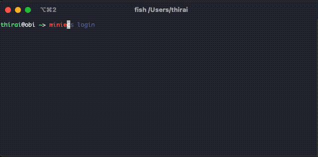

こんにちは [@jedipunkz](https://twitter.com/jedipunkz) 🚀 です。

今回は Go 言語で ECS コンテナにログインする CLI を作った話を書きます。

### 開発の経緯

自分はまだ Go 言語の初学者で学習のために開発するアイデアを探していた状態でした。そこで自分の勤めている会社で ECS Execute 機能を使ったコンテナログインの機能を開発者に提供していた事を思い出し色々調べていて「もう少し手間が省けないか？」と思い立った、という経緯で開発をはじめました。

### awscli を使った ECS Execute 機能によるコンテナログイン

手間が多いと書きましたが実際に awscli を使う場合どの程度の手間があるのか簡単に記します。まず下記のコマンドを実行して

```shell
$ aws ecs list-tasks --cluster <クラスタ名> --service <サービス名>
```

taskArn が得られるので Arn から task ID を拾って、その task ID を使って

```shell
$ aws ecs execute --cluster <クラスタ名> \
  --task <task ID> \
  -- container <コンテナ名> \
  --interfactive \
  --command "sh"
```

とコマンドを実行することでコンテナにログイン出来ます。が手間が少し多いのと task ID を拾い出す作業も辛いので改善したい...。

### 操作画面

ということで miniecs という CLI を作ったのですが、 まずは操作している様子を貼り付けます。😷 Fuzzy Finder なインクリメンタルサーチが出来る CLI になっていて、ECS クラスタ名・ECS サービス名・コンテナ名を一部入力するとログインしたい環境が選択出来るツールになっています。



### 使ったライブラリ

下記のライブラリを使って開発しました。CLI のフレームワークは `spf13/conbra`。コンフィギュレーションローダの `spf13/viper`。ログ出力は `sirupsen/logrus`。Fuzzy Finder は `ktr0731/go-fuzzyfinder` を使った感じです。

- [github.com/aws/aws-sdk-go](github.com/aws/aws-sdk-go)
- [github.com/ktr0731/go-fuzzyfinder](github.com/ktr0731/go-fuzzyfinder)
- [github.com/sirupsen/logrus](github.com/sirupsen/logrus)
- [github.com/spf13/cobra](github.com/spf13/cobra)
- [github.com/spf13/viper](github.com/spf13/viper)

### コード

下記のレポジトリで Apache 2.0 ライセンスで公開しています。`miniecs` という名前です。

https://github.com/jedipunkz/miniecs.git

### aws-sdk-go の利用と AWS サポートに教えてもらった内容

aws-sdk-go v1 を今回利用しました。下記の関数 `ExecuteCommand` を用います。

https://docs.aws.amazon.com/sdk-for-go/api/service/ecs/#ECS.ExecuteCommand

インプットとしては [ExecuteCommandInput](https://docs.aws.amazon.com/sdk-for-go/api/service/ecs/#ExecuteCommandInput) で下記のような情報を入れる形です。

```go
type ExecuteCommandInput struct {
    Cluster *string `locationName:"cluster" type:"string"`
    Command *string `locationName:"command" type:"string" required:"true"`
    Container *string `locationName:"container" type:"string"`
    Interactive *bool `locationName:"interactive" type:"boolean" required:"true"`
    Task *string `locationName:"task" type:"string" required:"true"`
}
```

アウトプットは [ExecuteCommandOutput](https://docs.aws.amazon.com/sdk-for-go/api/service/ecs/#ExecuteCommandOutput) で下記のようになります。

```go
type ExecuteCommandOutput struct {
    ClusterArn *string `locationName:"clusterArn" type:"string"`
    ContainerArn *string `locationName:"containerArn" type:"string"`
    ContainerName *string `locationName:"containerName" type:"string"`
    Interactive *bool `locationName:"interactive" type:"boolean"`
    Session *Session `locationName:"session" type:"structure"`
    TaskArn *string `locationName:"taskArn" type:"string"`
}
```

ここで疑問点が浮上。関数 `ExecuteCommand` を実行すると何も考えずにコンテナにログインが可能になるのかと思いきや出来ない模様。
そこで AWS サポートに問い合わせ下記のような回答を頂きました。

> aws-sdk-go の ExecuteCommand を使ってコンテナにログインするには戻り値 ExecuteCommandOutput の情報を利用して [session-manager-plugin](https://docs.aws.amazon.com/ja_jp/systems-manager/latest/userguide/session-manager-working-with-install-plugin.html) を利用する必要があります。

ふむ。ただ session-manager-plugin は OS にインストールするバイナリ形式のファイルで特にオプションを渡して実行できるような CLI 形式のコマンドではない模様でした。更に AWS の回答を読むと

> ぜひ AWS で開発して Apache 2.0 で公開している copilot-cli を参考にして下さい。

とあって、実際にコードを見てみました。下記が実際にコンテナへのログインをしているセッションを張っている関数のようです。
https://github.com/aws/copilot-cli/blob/mainline/internal/pkg/exec/ssm_plugin.go

```go
// StartSession starts a session using the ssm plugin.
func (s SSMPluginCommand) StartSession(ssmSess *ecs.Session) error {
	response, err := json.Marshal(ssmSess)
	if err != nil {
		return fmt.Errorf("marshal session response: %w", err)
	}
	if err := s.runner.InteractiveRun(ssmPluginBinaryName,
		[]string{string(response), aws.StringValue(s.sess.Config.Region), startSessionAction}); err != nil {
		return fmt.Errorf("start session: %w", err)
	}
	return nil
}
```

Apache 2.0 ライセンスということで今回開発した miniecs でもこのあたりのコードは利用・参考にしています。

### まとめ

まだテストを書いていないのとリファクタの進んでいないですしサブコマンドの数も `list` (環境一覧表示), `exec` (コマンド実行), `login` (コンテナログイン) だけという状況なので、もう少し機能を増やしたいなと思いつつあまりアイデアがないです。Go 初学者にとっては良い開発テーマだったとは思っています。

#### 次に何を開発するか ...
aws-sdk-go を使った開発は幾つかしてきて、そろそろ方向性を変えたいなとも思いつつ何を作るべきか... 🤔 。Prometheus の Exporter や、Datadog の Go SDK を使った開発なども良さそうかなぁ。😷 ちょうど昨日思いついたアイデアとしては ECR のイメージスキャン (また aws-sdk-go 使うけど) を実行する Lambda を開発して Datadog か Prometheus にデータを入れて、可視化・分析するなどどうかなぁと思いました。

- GitHub Actions でアプリの Docker ビルド & ECR プッシュと同時に API Gateway 経由でイメージスキャンして結果を Datadog カスタムメトリクスとして送信
- 一定期間毎に ECR イメージスキャンする Prometheus Exporter を開発

どちらも面白そう🤤
