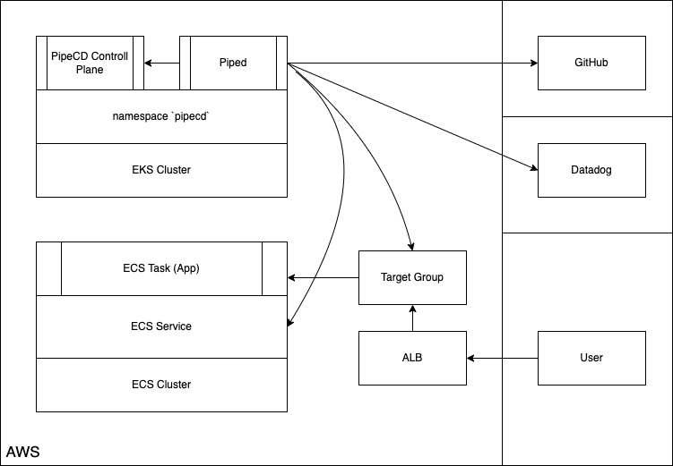
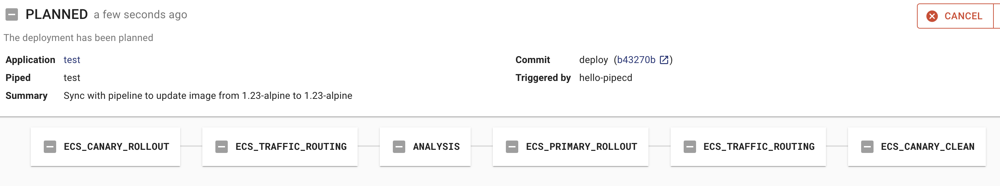
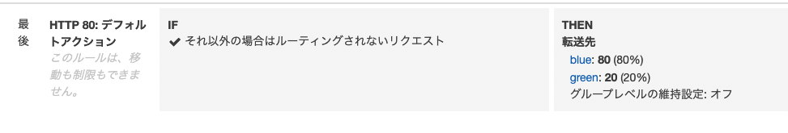
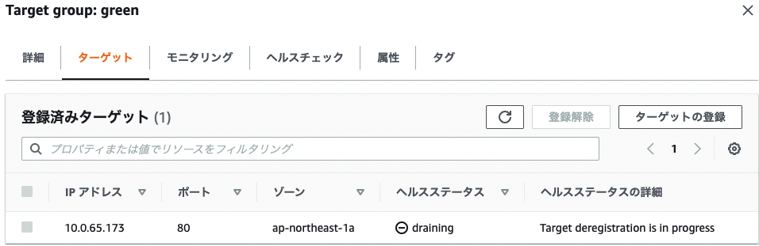
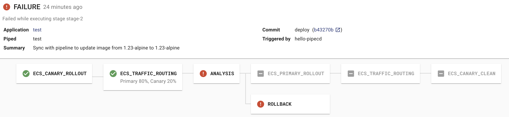

こんにちは [@jedipunkz](https://twitter.com/jedipunkz) 🚀 です。

今回は CNCF にジョインした [PipeCD](https://pipecd.dev/) と Datadog を用いて ECS 環境にてプログレッシブデリバリーを実現する方法について調査したので、その内容を記したいと思います。

## そもそもプログレッシブデリバリーとは

アプリケーションのデリバリー方法はカナリーリリースやブルーグリーンデプロイメント等がよく知られていると思います。プログレッシブデリバリーはその一歩先を行くデリバリー方式で、Prometheus や Datadog 等のメトリクスを用いて SLO (SRE の SLO と言うよりはデプロイのための指標という意味での) を元にカナリーリリースしたアプリケーションが期待した動作をしているかを確認し (プログレッシブデリバリー的にはこのフェーズを ANALYSIS という様です)、その上でカナリーリリースを完了するというフローになります。

## 構成 Pipecd, Piped 共に Kubernetes (EKS) クラスタ上に起動する構成

この検証ではこちらの構成を選択しました。この構成の特徴は

- piped は pipecd の API エンドポイントを指し示す
- pipecd は UI を提供
- pipecd は Filestore (S3, GCS, Minio など), Datastore (MySQL, Firestore など) を利用可 (今回は Minio, MySQL を選択)
- piped は Target Group, ECS タスク定義等の操作を行うため ECS API へのアクセス権限が必要
- piped の pipeline 上のステージで ANALYSIS という Datadog 等のメトリクスを解析する機能を有している
- アプリケーションレポジトリには app.pipecd.yaml を配置しターゲットグループ・タスク定義・ECS サービスを指し示す
- piped は GitHub レポジトリを参照

となっています。

また[こちらの公式ドキュメント](https://pipecd.dev/docs/operator-manual/piped/installation/installing-on-fargate/) には piped のプロセスを ECS/Fargate に起動する構成も紹介されていましたが、その際に

- piped -> pipecd のアクセスが同一 namespace 内で完結しないので Ingress が必要

という制約が出てきます。また piped はシングルバイナリでどこで稼働していても同じなので、今回は下記の構成を選択しました。




## 検証環境の構築手順

### 前提の環境

前提として下記を事前に構築・準備する必要があります。今回は情報量が多くなってしまうのでここの手順は割愛します。

- ローカルマシンに helm をインストール
- EKS クラスタを構築
- `pipecd` という名前の namespace をアサインしている Fargate Profile を用意
- `blue`, `green` という ALB ターゲットグループ・リスナーを用意

### アプリケーションレポジトリの用意

下記のディレクトリ構成でレポジトリを作成していきます。実際には IAM, Subnet, Security Group 等、構築した環境に合わせる必要があります。

```
.
├── app.pipecd.yaml
├── servicedef.yaml
└── taskdef.yaml
```

### タスク定義ファイル

`taskdef.yaml` として保存します。

```yaml
family: pipecd-nginx-sample
executionRoleArn: arn:aws:iam::********:role/ecs-taskexecution-iamrole
containerDefinitions:
  - command: null
    cpu: 100
    image: public.ecr.aws/nginx/nginx:1.23-alpine
    memory: 100
    mountPoints: []
    name: web
    portMappings:
      - containerPort: 80
compatibilities:
  - FARGATE
requiresCompatibilities:
  - FARGATE
networkMode: awsvpc
memory: 512
cpu: 256
pidMode: ""
volumes: []
```

### ECS サービスファイル

`servicedef.yaml` として保存します。

```yaml
cluster: arn:aws:ecs:ap-northeast-1:********:cluster/ecs-cluster
serviceName: pipecd-nginx-sample
desiredCount: 2
deploymentConfiguration:
  maximumPercent: 200
  minimumHealthyPercent: 0
schedulingStrategy: REPLICA
deploymentController:
  type: EXTERNAL
enableECSManagedTags: true
propagateTags: SERVICE
launchType: FARGATE
networkConfiguration:
  awsvpcConfiguration:
    assignPublicIp: ENABLED
    securityGroups:
      - sg-********
    subnets:
      - subnet-********
      - subnet-********
```

### Piped が参照するコンフィギュレーションファイル

このファイルについて説明すると

- kind: ECSApp として pipecd.dev/vbeta1 API にアクセス
- ECS サービスファイル・タスク定義ファイルの指定を行う
- primary, cannary として先程作成した `blue`, `green` のターゲットグループを指定する
- `pipeline` 設定で各パイプラインのステージを指定する
  - `ECS_CANARY_ROLLOUT` で green ターゲットグループの ECS タスクをローリングデプロイ
  - `ECS_TRAFFIC_ROUTING` で green ターゲットグループに対して 20% のトラヒックを寄せる
  - `ANALYSIS` で Datadog Metrics にクエリを投げ、閾値超過の際は FAIL するように設定
    - 下記の例では全体のリクエスト数に対しての 5xx 系エラーの率が 10% を超えない事を期待しています
  - `ECS_PRIMARY_ROLLOUT` で blue ターゲットグループの ECS タスクのローリングデプロイを実施
  - `ECS_TRAFFIC_ROUTING` で blue ターゲットグループに対して 100% のトラヒックを寄せる
  - `ECS_CANARY_CLEAN` で green ターゲットグループの ECS タスクをクリーンアップ

※ ここでは THRESHOLD (閾値超過) の strategy を選択していますが、その他のものについては考察で述べます。

`app.pipecd.yaml` として保存します。

```yaml
apiVersion: pipecd.dev/v1beta1
kind: ECSApp
spec:
  name: canary
  labels:
    env: example
    team: xyz
  input:
    serviceDefinitionFile: servicedef.yaml
    taskDefinitionFile: taskdef.yaml
    targetGroups:
      primary:
        targetGroupArn: arn:aws:elasticloadbalancing:ap-northeast-1:********:targetgroup/blue/********
        containerName: web
        containerPort: 80
      canary:
        targetGroupArn: arn:aws:elasticloadbalancing:ap-northeast-1:********:targetgroup/green/********
        containerName: web
        containerPort: 80
  pipeline:
    stages:
      - name: ECS_CANARY_ROLLOUT
        with:
          scale: 30
      - name: ECS_TRAFFIC_ROUTING
        with:
          canary: 20
      - name: ANALYSIS
        with:
          duration: 10m
          metrics:
            - strategy: THRESHOLD
              provider: datadog-provider
              interval: 1m
              expected:
                max: 10
              query: |
               sum:aws.applicationelb.httpcode_elb_5xx{env:prd,hostname:sample-lb-********.ap-northeast-1.elb.amazonaws.com}.as_count()
               /
               sum:aws.applicationelb.request_count{env:prd,hostname:sample-lb-********.ap-northeast-1.elb.amazonaws.com}.as_count()
      - name: ECS_PRIMARY_ROLLOUT
      - name: ECS_TRAFFIC_ROUTING
        with:
          primary: 100
      - name: ECS_CANARY_CLEAN
```

### Pipecd 構築

#### Pipecd のコンフィギュレーション作成

Pipecd (Control Plane) のコンフィギュレーション `control-plane-values.yaml` を下記の通り用意します。
運用を想定すると `quickstart.enabled: false` として S3 や RDS 等を用いる構成が望ましいと思いますが、今回の目的ではないのでここでは `quickstart.enabled: true` として Pipecd を構築します。

```yaml
quickstart:
  enabled: true

config:
  data: |
    apiVersion: "pipecd.dev/v1beta1"
    kind: ControlPlane
    spec:
      datastore:
        type: MYSQL
        config:
          url: root:test@tcp(pipecd-mysql:3306)
          database: quickstart
      filestore:
        type: MINIO
        config:
          endpoint: http://pipecd-minio:9000
          bucket: quickstart
          accessKeyFile: /etc/pipecd-secret/minio-access-key
          secretKeyFile: /etc/pipecd-secret/minio-secret-key
          autoCreateBucket: true
      projects:
        - id: quickstart
          staticAdmin:
            username: hello-pipecd
            passwordHash: "$2a$10$ye96mUqUqTnjUqgwQJbJzel/LJibRhUnmzyypACkvrTSnQpVFZ7qK" # bcrypt value of "hello-pipecd"

secret:
  encryptionKey:
    data: encryption-key-just-used-for-quickstart
  minioAccessKey:
    data: quickstart-access-key
  minioSecretKey:
    data: quickstart-secret-key

mysql:
  rootPassword: "test"
  database: "quickstart"
```

#### Pipecd のデプロイ

下記のように helm を使って EKS 上に Pipecd をデプロイします。

```shell
helm install pipecd oci://ghcr.io/pipe-cd/chart/pipecd --version v0.34.0 \
  --namespace pipecd --create-namespace \
  --values ./control-plane-values.yaml
```

### Piped 構築
#### Pipecd UI にログインし piped の id, key を取得

kubernetes service に作業端末から port forwarding します。

```shell
kubectl -n pipecd port-forward svc/pipecd 8080
```

ブラウザで http://localhost:8080 にログインします。

- project name: quickstart
- username: hello-pipecd
- password: hello-pipecd

トップページ -> プロフィールアイコン -> Settings に遷移して Piped タブを選択し `+ADD` ボタンを押下。適当な名前・説明を入力し Piped ID, Key を生成したらメモする

#### Piped のコンフィギュレーション

`piped-key-file` に上記で得た Piped Key を記します。

```shell
echo '<PIPED_KEY>' > piped-key-file
```

コンフィギュレーションには下記のような情報を記します。

上記で得た情報等を記します。

- PipeCD UI で得た Piped ID
- PipeCD UI で得た Piped Key ファイルの指定
- 上記の手順で作成した Git レポジトリ指定
- プライベート Git レポジトリにアクセスするための SSH 鍵
- AWS リージョン情報
- AWS 機密情報のファイル指定 (後にローカルのファイルパスを指定)
- AWS 機密情報ファイル内のプロファイル名
- Datadog API, APP Key 指定

```yaml
apiVersion: pipecd.dev/v1beta1
kind: Piped
spec:
  projectID: quickstart
  pipedID: <上記で得た PipedID を記す>
  pipedKeyFile: /etc/piped-secret/piped-key
  apiAddress: pipecd:8080
  git:
    sshKeyFile: /etc/piped-secret/ssh-key
  repositories:
    - repoId: <Git レポジトリ名>
      remote: git@github.com:jedipunkz/<レポジトリ名>.git
      branch: main
  syncInterval: 1m
  cloudProviders:
    - name: sample-ecs
      type: ECS
      config:
        region: ap-northeast-1
        credentialsFile: /etc/piped-secret/credentials-key
        profile: <AWS Profile 名>
  analysisProviders:
    - name: rf-sandbox-datadog
      type: DATADOG
      config:
        apiKeyFile: /etc/piped-secret/datadog-api-key
        applicationKeyFile: /etc/piped-secret/datadog-application-key
```

#### Piped の起動

事前に Datadog API, APP Key の内容をファイルに保存します。

```shell
echo '<Datadog API Key>' > datadog-api-key
echo '<Datadog APP Key>' > datadog-application-key
```

下記の情報を加えて Piped を起動する。

- 上記で作成したコンフィギュレーションファイル名 `piped-config-k8s-canary.yaml`
- 上で作成した Piped Key の内容をしるした `piped-key-file`
- プライベート Git レポジトリにアクセスするための SSH 秘密鍵
- AWS 機密情報を記したファイル `~/.aws/credentials`
- Datadog API, APP Key の内容を記したファイル指定

```yaml
helm upgrade -i piped oci://ghcr.io/pipe-cd/chart/piped --version=v0.34.0 --namespace=pipecd \
  --set-file config.data=./piped-config-k8s-canary.yaml \
  --set-file secret.data.piped-key=./piped-key-file \
  --set-file secret.data.ssh-key=/Users/foo/.ssh/pipecd \
  --set-file secret.data.credentials-key=/Users/foo/.aws/credentials \
  --set args.insecure=true \
  --set-file secret.data.datadog-api-key=./pipecd/datadog-api-key \
  --set-file secret.data.datadog-application-key=./datadog-application-key
```

### 事前のタスク定義のレジスト

事前に利用するタスク定義をレジストする必要がある。
下記の内容で `taskdef-nginx.json` というファイルに保存します。

```json
{
  "family": "pipecd-nginx-sample",
  "executionRoleArn": "arn:aws:iam::********:role/ecs-taskexecution-iamrole",
  "containerDefinitions": [
    {
      "name": "web",
      "essential": true,
      "image": "public.ecr.aws/nginx/nginx:1.23-alpine",
      "mountPoints": [],
      "portMappings": [
        {
          "containerPort": 80,
          "hostPort": 80,
          "protocol": "tcp"
        }
      ]
    }
  ],
  "requiresCompatibilities": [
    "FARGATE"
  ],
  "networkMode": "awsvpc",
  "memory": "512",
  "cpu": "256"
}
```

下記のように awscli を用いてレジストします。

```shell
aws ecs register-task-definition --cli-input-json file://taskdef-nginx.json
aws ecs list-task-definitions | grep nginx #<-- 確認
```

## 動作確認

PipeCD UI の Application の画面において下記の内容で PipeCD UI 上の Application を `+ADD` します。

- Name に任意の名前を入力
- kind で ECS を選択
- Piped で上記の手順で登録した Piped を選択
- Cloud Provider で sample-ecs を選択
- Repository で Git レポジトリ名を選択
- Config Filename で `app.pipecd.yaml` を選択

Sync ボタンを押してデプロイ開始。結果 Deployment 画面を確認すると下記の状態になっている。



デプロイが進み、Primary (上記の green) への ROLLOUT (デプロイ) が完了する


Target Group green のターゲットにタスクが一つ起動し始める


また同じタイミングで ALB リスナーを確認すると 20% のトラヒックが green に寄せられていることを確認できる



その後 Deployment が SUCCESS で完了する


その結果 green のターゲットが draining になる



ALB Listener も blue: 100% と Canary リリースの Primary の Target Group へトラヒックが 100% 寄せられている事を確認出来る。これでデプロイ完了となります。


### Fail するパターンの動作

常時 0.3 以上のパーセンテージを示しているクエリ(当方の環境)に対して下記のように `expected.max: 0.01` と指定してみる。

```yaml
      - name: ANALYSIS
        with:
          duration: 30m
          metrics:
            - strategy: THRESHOLD
              provider: sample-datadog
              interval: 10m
              expected:
                max: 0.01
              query: |
              query: |
               sum:aws.applicationelb.httpcode_elb_5xx{env:prd,hostname:sample-lb-********.ap-northeast-1.elb.amazonaws.com}.as_count()
               /
               sum:aws.applicationelb.request_count{env:prd,hostname:sample-lb-********.ap-northeast-1.elb.amazonaws.com}.as_count()
```

結果としてはパイプラインの `ANALYSIS` ステージで想定した通り Fail し、結果 `ROLLBACK` された。



## 考察

検証環境では Canary リリース・Datadog Analysis・THRESHOLDS 戦略を用いて動作確認し、

- (1) デプロイ開始
- (2) Canary 環境へデプロイ
- (3) 部分的にトラヒックを Canary に寄せる
- (3) Datadog Metrics を解析しつつ問題なければ Primary 環境へデプロイ
- (4) Primary に100%のトラヒックを寄せる
- (5) Canary 環境をクリーンアップ

という流れで、カナリーリリースとプログレッシブデリバリーが実践出来ました。

### Datadog Analysis Provider 利用時の注意点

通常であればアプリケーションをデプロイし、ALB のエラー率等を計測しそれを Analysis Provider で指定することになります。その場合 AWS Intergration の機能で Cloudwatch Metrics -> Datadog Metrics とメトリクス情報を送信する必要がありますが、

- 遅延が数分ある
- ALB メトリクスのプロットのインターバルが1分である

という問題が浮上します。

このことは秒単位で exporter からのデータを Scrape する Prometheus では問題になりません。実際 PipeCD は Prometheus を一番のターゲットにして開発されています。(コンフィギュレーションの scrape_interval (default: 1s) に相当する) よって、Datadog を Analysis Provider に利用する際には下記の幾つかの方法を検討する必要があります。

### その他の Analysis のパイプライン戦略

検証では `THRESHOLDS` という閾値設定型の戦略を取りましたが、他にも幾つかの戦略が PipeCD には存在します。下記がそれらです。

####  (1) `PREVIOUS` : メトリックを最後に成功したデプロイメントと比較する方法

下記は例で前回 (最後) のデプロイメントのメトリクスクエリ計測結果と比較して、前回よりも偏差が高い場合、Fail する、というものになっています。

```yaml
apiVersion: pipecd.dev/v1beta1
kind: KubernetesApp
spec:
  pipeline:
    stages:
      - name: ANALYSIS
        with:
          duration: 30m
          metrics:
            - strategy: PREVIOUS
              provider: my-prometheus
              deviation: HIGH
              interval: 5m
              query: |
                sum (rate(http_requests_total{status=~"5.*"}[5m]))
                /
                sum (rate(http_requests_total[5m]))  
```

#### (2) `CANARY_BASELINE` :  Canary バリアントと Baseline バリアントの間でメトリックを比較する方法

下記は例で Canary, Baseline とでメトリクスを比較しつつ、最終的に deviantion: HIGH という条件で Fail します。

```yaml
apiVersion: pipecd.dev/v1beta1
kind: KubernetesApp
spec:
  pipeline:
    stages:
      - name: ANALYSIS
        with:
          duration: 30m
          metrics:
            - strategy: CANARY_BASELINE
              provider: my-prometheus
              deviation: HIGH
              interval: 5m
              query: |
                sum (rate(http_requests_total{job="foo-{{ .Variant.Name }}", status=~"5.*"}[5m]))
                /
                sum (rate(http_requests_total{job="foo-{{ .Variant.Name }}"}[5m]))                
```

#### (3) `CANARY_PRIMARY` (非推奨) : Canary バリアントとPrimary バリアントの間でメトリックを比較する方法

非推奨の戦略。何らかの理由でベースラインバリアントを提供できない場合は、Canary と Primary を比較することができる。

## 所感

一応 PipeCD と ECS, Datadog を用いることでプログレッシブデリバリーを実践出来ました。運用を想定すると RDS, S3 等を用いる構成を組んだほうが良いと思います。またユーザからのリクエストを受けている ECS とは切り離して EKS 上の PipeCD, Piped を運用出来るので、万が一何かあった際、またバージョンアップ等の移行を想定したとしても比較的運用しやすいように思います。あとは考察のところに記した Datadog を用いる際に出てくる難しさをどうクリアするかはいくつかの検討を重ねる必要がありそうです。そのあたりの詳細については自分が努めている企業のテックブログの方に記したいと思います！

