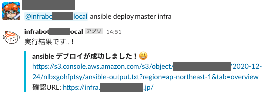

こんにちは。[jedipunkz](https://twitter.com/jedipunkz) です。

仕事ではこれから会社のサービス環境として AWS ECS の導入を始めていくところなのですが、最近の SRE/インフラ界隈のトレンドを自分たちが追うために自分たち SRE が管理しているボット環境を EKS を使って GitOps 化しようということになり色々と準備を進めています。導入までもう一歩のところまで来たので、構成や技術要素についてここに記したいと思います。

## どんなボットが動いているの？

まずボット開発に用いてる言語は Go 言語です。主に aws-sdk-go を使ってボットを開発しています。私達はコミュニケーションツールとして Slack を使っているので Slack ボット化するためには [slack-go](https://github.com/slack-go/slack) を使っています。 ただまだボットの数が少なく主に利用されてるのは Ansible を実行するモノです。開発環境へアプリをデプロイするのに Ansible を使っています。もうすぐ ECS 化するので役割はそろそろ終えるのですが... 利点は開発者だけでなく非エンジニアの方が GitHub のブランチ上のアプリの動作をしたい際に Slack を使って簡単にアプリの動作ができるところです。今後は自動化目的でもっと沢山のボットを開発していきたいです。



## EKS/Fargate vs EKS/EC2

EKS の利用を検討する際に Fargate タイプと EC2 タイプがあります。2020年の今年頭に評価した際には ALB Ingress Controller と HPA のための Metrics Server が正常に動作しない状態だったので、まだ EC2 タイプを選択すべきなのかな...と考えたのですが AWS 的にも Fargate を推してる気もするし再度評価実施しました。結果ドキュメントもソフトウェアもだいぶ更新されていて ALB Ingress Controller も Metrics Server もあっけなく動作し、今回のボット環境も EKS/Fargte を選択しました。

## (ちょっと余談) そもそもサービス環境はなぜ EKS でなく ECS？

AWS ECS の導入を始めようとしていると前述しましたが、なぜサービス環境には EKS ではなく ECS を選択したかというと、この両者で下記の観点で評価実施しました。※ () 内はまだ未実施。

- コード化
- オートスケール
- ロードバランサ
- 機密情報の格納展開
- CI/CD, GitOps
- ロギング
- メトリクス収集
- モニタリング
- カナリーリリース等のリリース方式
- (バッチ)
- (サービスメッシュ)

結果的にインフラをデプロイする主な機能 (特に ALB Ingress Controller, Metric Server) を時前で Pod として運用するのは運用コストが高い、という判断をしました。Pod の調子が悪いからロードバランサがデプロイできない！というのは辛いです。自分の務めている会社は少人数で運用コストを減らすという視点で技術を選択しているので、今の時点では ECS を選択するのは必然でした。ECS であれば Terraform -> AWS API で確実に必要なインフラがデプロイ出来ますし。

## ボット環境を GitOps 化する全体構成

構成は下記のとおりです。

```
        (3 get manifest
        +----------------------------------------+
        |                                        |
+----------------+   (2      +----------------+  |
| GitHub Actions |---------> | ECR Repository |  |
+----------------+           +----------------+  |
+                            + (4 pull image     |
| (1 merge to master         |                   |
|                            +----------------+  |
|                            |      Bots      |  |
|                            +----------------+  |
|                            |     ArgoCD     |--+
+----------------+           +----------------+    +---------------+
|    Engineer    |           |   EKS/Fargate  |--->|  EFS Volumes  |
+----------------+           +----------------+    +---------------+
```

処理の流れは...

- (1 Engineer がアプリ用 Git レポジトリの master ブランチへ Push
- (2 GitHub Actions により Docker コンテナビルド, ECR への Push & Kustomize によりコンテナイメージタグが更新
- (3 ArgoCD が GitHub 上の Manifest ファイルの更新をトリガに EKS へローリングデプロイ開始
- (4 ArgoCD によって新たに指定されたイメージを ECR から Pull しデプロイ完了

## なぜ EFS を使っているか ?

EFS は 永続的なストレージとして利用しています。今後は不要になる可能性が高いのですが前述した Ansible を使ったボットは Playbook を収めた Git レポジトリにアクセスしてデプロイを実行します。コンテナに Git レポジトリを収めるのはコンテナイメージサイズが肥大化しますし良くないと判断しました。結果、EKS から EFS を Volume マウントして Ansible を実行します。また Ansible 以外のボットも環境ごとの情報を格納した yaml ファイルを扱うのですが、その yaml ファイルを EFS 上に Kubernetes Secrets として展開しています。

## ArgoCD を選択した理由

ArgoCD が CNCF にジョインしたというニュースが今年の夏頃？ありました。また同時に検討していた Flux がちょうどメジャーバージョンアップをして、だいぶ利用方法やドキュメントが刷新されました。また一世代前のバージョンはメンテナンスモードに突入。新しいバージョンは利用方法が少し複雑化していましたし CLI は劇的に利用方法が変化していました。ということで GitOps をしたいという要望だけ満たせれば良いので CNDF の ArgoCD を利用することにしました。

ArgoCD はボットと同じ EKS クラスタ上にデプロイしました。UI は普段利用しないので Ingress は設定せず EKS Fargate Profile の稼働しているプライベートサブネット上で起動させました。ArgoCD アプリは下記の手順で作成します。

```shell
$ argocd app create hello --repo https://github.com/jedipunkz/no-exsist-bot-repo.git --path bots/hello/manifests/envs/dev --dest-server https://kubernetes.default.svc --dest-namespace infra-bot
$ argocd app set hello --sync-policy automated
$ arogcd app set hello --auto-prune
```

この操作で ArgoCD が GitHub 上の Manifests の変化に応じてボットのコンテナイメージを ECR から取得して GitOps を実現してくれます。

## Kustomize で環境

Manifest の環境を分離し、コンテナイメージのタグを編集するために Kustomize を使っています。イメージの更新するためには Kustomize は必須な技術要素な気がしています。

```
bots
└── ansible
    ├── Dockerfile
    ├── README.md
    ├── bot.go
    ├── go.mod
    ├── go.sum
    ├── main.go
    ├── manifests
    │   ├── base
    │   │   ├── bot-deployment.yaml
    │   │   ├── bot-svc.yaml
    │   │   └── kustomization.yaml
    │   ├── envs
    │   │   ├── dev
    │   │   │   ├── deployment.yaml
    │   │   │   └── kustomization.yaml
    │   │   └── prd
    │   │       ├── deployment.yaml
    │   │       └── kustomization.yaml
    │   └── manual
    │       └── secrets.yaml
    └── requirements.txt
```

## GitHub Actions を用いた Docker ビルド, ECR イメージプッシュ, Kustomize Edit

GitHub Actions を使ってボットの追加・編集 PR をマージしたタイミングで

- Docker ビルド
- ECR へのプッシュ
- Kustomize Edit をして Manifest に記しているコンテナイメージのタグを更新

をしています。GitHub Actions の処理としてはこれだけで、あとは ArgoCD が GitHub 上の Manifests の更新に反応して自動で GitOps してくれます。

## まとめ

構成する技術要素としては以上です。先に述べましたが kubernetes を SRE として運用することは昨今の SRE/インフラ界隈のトレンドを押さえるという意味で意味があることですし、今回数ヶ月ぶりに EKS を評価・検証して、技術として速いスピードで成熟しているのを実感しました。今後 EKS を本番サービスでも利用することもあるかもしれないです。ALB Ingress Controller, Metrics Server だけではなく ArgoCD も今年の2月に評価した際よりだいぶ完成度が増している気がします。

EKS 導入前は Docker Compose でボットをデプロイしていて半自動化状態でした。ボットを作る足かせにもなっていたので、EKS の導入で今後のボット開発の敷居が下がり、自動化がますます推進されればいいなと思っています。


