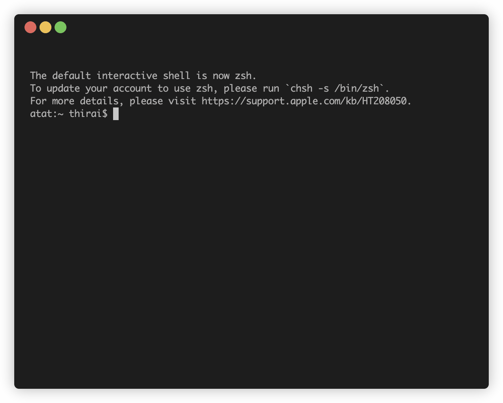

こんにちは。[jedipunkz](https://twitter.com/jedipunkz) です。

今回は、kubectl プラグインを開発したことがなかったので、Go の学習と合わせてためしに1つ作ってみたのでその内容を記したいと思います。

## 開発した kubectl plugin: kubectl-fuzzy-login

下記が今回開発した kubectl プラグインです。

https://github.com/jedipunkz/kubectl-fuzzy-login

### 何が出来るか

下記のキャプチャをご覧頂くと一目瞭然だと思います。

Kubernetes のポッドとコンテナをインクリメンタルサーチしつつ選択し、最終的にコンテナにログイン出来るプラグインになっています。コンテナがサイドカー構成になっていた場合は、そのうちのどのコンテナにログインするかもインクリメンタルサーチ出来ます。なお、このプラグインは Go で開発しました。



### インストール方法

[Krew](https://krew.sigs.k8s.io/) を利用している場合は下記の操作でインストールできます。Krew が事前にインストールされている必要があります。

```shell
git clone https://github.com/jedipunkz/kubectl-fuzzy-login.git
kubectl krew install --manifest=./kubectl-fuzzy-login/krew/fuzzy-login.yaml
```

マニュアル操作でインストールする場合は下記です。

```shell
git clone https://github.com/jedipunkz/kubectl-fuzzy-login.git
cd kubectl-fuzzy-login
go build
cp kubectl-fuzzy-login /your/bin/path
```

### 使用方法

#### オプション無しで、全 Namespaces を対象に検索・ログインする

オプションを使用しない場合は下記のように実行します。

```shell
kubectl fuzzy login 
```

まず Pod を選択します。Pod 名の一部を入力することでインクリメンタル・ファジー検索出来ます。その Pod に複数のコンテナ (サイドカー) がある場合、更にコンテナをインクリメンタルサーチ出来ます。最終的にコンテナを選択し Enter ボタンを押すことでコンテナにログイン出来ます。ただしコンテナイメージにシェルが入っていない場合は入ることが出来ません。

#### シェル指定

また下記のように `-s` オプションでデフォルトのシェルを指定することもできます。

```shell
kubectl fuzzy login -s /bin/bash
```

#### Namespace 指定

Namespace を `-n` オプションで指定することもできます。

```shell
kubectl fuzzy login -n default
```


## Kubectl Plugin 開発の基本

Kubectl Plugin の開発方法の基本について軽く記します。

Kubectl Plugin は、Kubernetes の CLI ツールである kubectl の拡張機能を提供します。これらのプラグインは、ユーザーが独自のカスタムコマンドを作成して kubectl に追加できるようにするためのものです。開発方法は以下の通りです。

### 言語の選択

プラグインは任意の言語で書くことができます。Bash でも書けるそうです。kubectlはプラグインを単に新しいプロセスとして実行します。そのため、プラグインはkubectlと同じマシン上で実行できる任意の言語で書くことができます。

### Plugin 名

`kubectl-` のプレフィックスで始まる名前を持つ必要があります。例えば `kubectl-foo-bar` という Plugin 名の場合、下記のように Plugin を使用することが出来ます。

```shell
kubectl foo bar
```

### Kubernetes クライアントライブラリの使用

プラグインが Kubernetes API と対話する必要がある場合、適切な Kubernetes クライアントライブラリを使用することが推奨されます。Goの場合は、[kubernetes/client-go](https://github.com/kubernetes/client-go) ライブラリが広く使用されているそうです。

## kubectl-fuzzy-login のコード構成の説明

### ディレクトリ構成

#### cmd/root.go
ここには、プラグインのエントリーポイントとなるコードが含まれています。このプラグインでは root.go というファイルがエントリーポイントとして機能しています。

主に以下の処理を行います。

1. Kubernetesクラスタとの接続を確立します。
2. PodGetter インターフェースを使用して、クラスタ内の全Podを取得します。
3. 取得したPodの中からユーザーが選択したPodを特定します。
4. ユーザーが選択したPod内のコンテナを特定します。
5. PodExecutor インターフェースを使用して、特定のコンテナにログインします。

#### internal/kubernetes

このディレクトリは、プラグインの内部機能を提供します。このプラグインでは、internal/kubernetes というサブディレクトリがあり、Kubernetesクラスタとのやり取りを担当しています。

- PodGetter: このインターフェースは、Kubernetesクラスタから Pod を取得するメソッドを定義しています。
- PodExecutor: このインターフェースは、Kubernetesクラスタ上の特定の Pod でコマンドを実行するメソッドを定義しています。

## Krew 対応について

[Krew](https://krew.sigs.k8s.io/) は kubectl プラグインを管理するためのプラグインマネージャーでプラグインの検索・インストール・更新が行なえます。Krew の公式レポジトリに PR を送って、誰もが自分の開発したプラグインを利用できるようにする方法もあるのですが、PR がマージされる必要があるので、今回はプライベートレポジトリ上に Manifest を作成してそれを利用する方法を取りました。(このあたりは HomeBrew に似ていますね)

作成した Manifest は下記になります。

https://github.com/jedipunkz/kubectl-fuzzy-login/blob/main/krew/fuzzy-login.yaml

上記と重複しますが、プライベートレポジトリ上の Manifest を利用して下記の通りこのプラグインをインストール出来ます。

```shell
git clone https://github.com/jedipunkz/kubectl-fuzzy-login.git
kubectl krew install --manifest=./kubectl-fuzzy-login/krew/fuzzy-login.yaml
```

## まとめ

Kubectl プラグインの開発自体は

- プラグインの命名によって操作方法が設定できる
- 任意の言語で開発できる
- Go を使う場合は client-go を使えば良い

ということで、比較的簡単に開発することが出来ました。今回は Go の Viper を使って `-n` や `-s` オプションを実装しましたが、このあたりも何でも良い気もします。自由度が高い分、逆にどうするべきなのか迷う点はあります。
