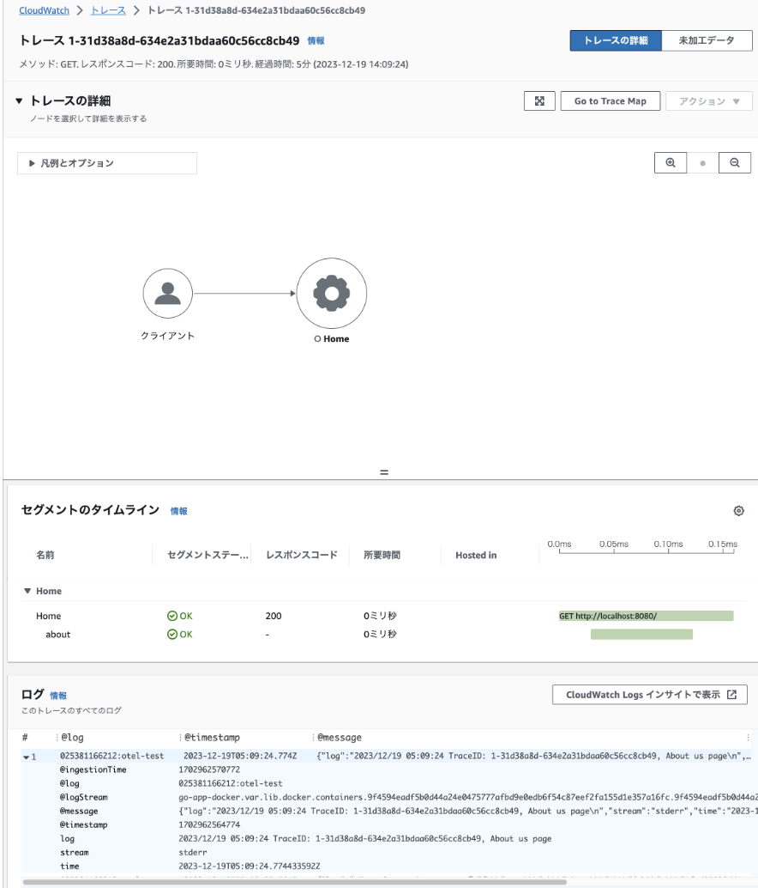

OpenTelemetry を使って AWS (X-Ray, Cloudwatch Logs) にトレースとログを計装する事に興味があったので調べた内容を記そうと思います。

## 構成

今回検証してみた構成は下記の様な構成です。AWS を用いた場合 ECS や EKS, Lambda で Go アプリを起動する事が通常ですが、今回は docker-compose で検証しました。ただ ECS, EKS に置き換えるのは比較的簡単だと思います。

```
        trace post          PutTelemetryRecords
+--------+      +----------------+      +-----------------+
| Go App | -+-> | Otel Collector | ---> |    AWS X-Ray    |
+--------+  |   +----------------+      +-----------------+
            |   +----------------+      +-----------------+
            +-> |   Fluent-Bit   | ---> | Cloudwatch Logs |
                +----------------+      +-----------------+
                                PutLogEvents
```

## ログとトレースの紐づけ

ログは Cloudwatch Logs へ、トレース情報は AWS X-Ray へ転送しますが、このログとトレースを紐付けると、運用する上で追跡が容易になります。この紐づけは AWS の場合は簡単で下記の要件を満たせば紐づけがされます。

- トレース ID は Otel 形式から X-Ray 形式に変換して (下記 IdOtel2Xray() 関数) トレース送信 (参考: https://zenn.dev/k6s4i53rx/articles/69ef65b84dd799)
- トレース ID をログに埋め込む (下記 log.Printf() )
- OpenTelemetry Exporter が初期化の際に毎回用いられる OpenTelemetry リソース作成の際にリソース属性として Cloudwatch Log Group を指定

## Go アプリ

早速ですがログとトレース情報を紐づけしつつ AWS に送信する Go アプリのコードの例を記します。このアプリはサイドカーで起動している `otel-collector` の 4317 ポートに送信し、その otel-collector は AWS X-Ray にトレースを送信。更にログは追加でサイドカー起動している fluent-bit を使って AWS Cloudwatch に送信する想定でコードを書いています。

```go
package main

import (
	"context"
	"log"
	"net/http"
	"os"

	"go.opentelemetry.io/contrib/instrumentation/net/http/otelhttp"
	"go.opentelemetry.io/otel"
	"go.opentelemetry.io/otel/exporters/otlp/otlptrace"
	"go.opentelemetry.io/otel/exporters/otlp/otlptrace/otlptracegrpc"
	"go.opentelemetry.io/otel/propagation"
	"go.opentelemetry.io/otel/sdk/resource"
	"go.opentelemetry.io/otel/sdk/trace"
	semconv "go.opentelemetry.io/otel/semconv/v1.10.0"
)

func initTracer() {
        ctx := context.Background()

        collectorAddress := os.Getenv("OTEL_COLLECTOR_ADDRESS")
        if collectorAddress == "" {
                collectorAddress = "otel-collector:4317"
        }

        // gRPCを使用してOpenTelemetry Collectorと通信するクライアントを作成します
        traceClient := otlptracegrpc.NewClient(
                otlptracegrpc.WithEndpoint(collectorAddress),
                otlptracegrpc.WithInsecure(),
        )

        // 作成したクライアントを使用して
        // トレースデータをエクスポートするエクスポーターを作成します
        traceExporter, err := otlptrace.New(ctx, traceClient)
        if err != nil {
                log.Fatalf("Failed to create trace exporter: %v", err)
        }

        // 新しいTracerProviderを作成します
        // これはトレースデータを生成するTracerを作成するためのものです
        tp := trace.NewTracerProvider(
                trace.WithBatcher(traceExporter),
                trace.WithResource(newResource()),
        )

        // 作成したTracerProviderをグローバルなTracerProviderとして設定します
        otel.SetTracerProvider(tp)
        // TraceContextを使用したPropagatorを設定します。
        // これはトレースコンテキストを伝播させるためのものです。
        otel.SetTextMapPropagator(propagation.TraceContext{})
}


func main() {
	initTracer()

    // http ハンドラ
	http.Handle("/", otelhttp.NewHandler(http.HandlerFunc(home), "Home"))

	log.Println("Server is running on port 8080...")
	log.Fatal(http.ListenAndServe(":8080", nil))
}

func home(w http.ResponseWriter, r *http.Request) {
    // Span の設定
	ctx := r.Context()
	tr := otel.GetTracerProvider().Tracer("example")
	_, span := tr.Start(ctx, "about")
	defer span.End()

    // Otel 形式の ID を X-Ray 形式に変換
	traceID := IdOtel2Xray(span.SpanContext().TraceID().String())

	log.Printf("TraceID: %s, About us page", traceID)
	w.Write([]byte("Welcome to the Home Page!"))
}

// OpenTelemetry Exporter が初期化の際に毎回用いられる OpenTelemetry リソース作成
// の際にリソース属性として Cloudwatch Log Group を指定
func newResource() *resource.Resource {
	LogGroupNames := []string{"otel-test"}
	return resource.NewWithAttributes(
		semconv.SchemaURL,
		semconv.AWSLogGroupNamesKey.StringSlice(LogGroupNames),
	)
}

func IdOtel2Xray(OtelId string) string {
	xrayId := "1-" + OtelId[0:8] + "-" + OtelId[8:]
	return xrayId
}
```

## Docker 関連ファイル

下記が docker-compose.yaml です。前述した通り otel-collector と fluent-bit をサイドカーとして起動しています。また AWS に情報を送信するためその両者では AWS 認証を行っています。

```yaml
version: '3.8'

services:
  go-app:
    build: .
    ports:
      - "8080:8080"
    environment:
      - OTEL_COLLECTOR_ADDRESS=otel-collector:4317
    depends_on:
      - otel-collector

  otel-collector:
    image: public.ecr.aws/aws-observability/aws-otel-collector:latest
    command: ["--config=/etc/otel-agent-config.yaml"]
    volumes:
      - ./otel-agent-config.yaml:/etc/otel-agent-config.yaml
    environment:
      - AWS_ACCESS_KEY_ID=****
      - AWS_SECRET_ACCESS_KEY=*****
      - AWS_REGION=ap-northeast-1
    ports:
      - "4317:4317"

  fluent-bit:
    image: fluent/fluent-bit:latest
    volumes:
      - /var/lib/docker/containers:/var/lib/docker/containers
      - /var/run/docker.sock:/var/run/docker.sock
      - ./fluent-bit.conf:/fluent-bit/etc/fluent-bit.conf
    environment:
      - AWS_ACCESS_KEY_ID=****
      - AWS_SECRET_ACCESS_KEY=****
      - AWS_REGION=ap-northeast-1
```

下記は Dockerfile です。

```dockerfile
FROM golang:1.21 AS builder

WORKDIR /app
COPY go.mod go.sum ./
RUN go mod download

COPY . .
RUN CGO_ENABLED=0 go build -o myapp .

FROM alpine:latest

WORKDIR /root/
COPY --from=builder /app/myapp .

CMD ["./myapp"]
```

## fluent-bit ファイル

下記は fluent-bit.conf です。ここで `otel-test` という Cloudwatch Log Group を指定していますが、これは予め AWS Console で作成しておきます。

```yaml
[SERVICE]
    Flush        1
    Daemon       Off
    Log_Level    info
    Parsers_File parsers.conf

[INPUT]
    Name              tail
    Tag               docker.*
    Path              /var/lib/docker/containers/*/*.log
    Parser            docker
    DB                /var/log/flb_docker.db
    Mem_Buf_Limit     5MB
    Skip_Long_Lines   On
    Refresh_Interval  10

[OUTPUT]
    Name              cloudwatch_logs
    Match             *
    region            ap-northeast-1
    log_group_name    otel-test
    log_stream_prefix go-app-
    auto_create_group On
```

## OpenTelemetry ファイル

下記は OpenTelemetry が参照する otel-agent-config.yaml ファイルです。

Reciever として otlp を指定、Exporter として X-Ray を指定。つまり Go アプリからのトレース情報を otel-collector が受け取り AWS X-Ray へ転送する役割を担っています。

```yaml
receivers:
  otlp:
    protocols:
      grpc:
      http:

processors:
  batch:

exporters:
  awsxray:
    region: 'ap-northeast-1'

service:
  telemetry:
    logs:
      level: "DEBUG"
  pipelines:
    traces:
      receivers:
        - otlp
      exporters:
        - awsxray
```

## 動作確認

ブラウザで http://localhost:8080/ へアクセスする。結果として AWS Console の X-Ray の画面を確認すると下記のようにトレース情報が出力されそこからログが追跡出来る事が分かります。



## まとめ

今回の Span 設定は `http.HandlerFun(home)` の home() 関数の中で行いました。よってトレース情報は単純な直線情報となっています。

```go
func home(w http.ResponseWriter, r *http.Request) {
	ctx := r.Context()
	tr := otel.GetTracerProvider().Tracer("example")
	_, span := tr.Start(ctx, "about")
	defer span.End()

	traceID := IdOtel2Xray(span.SpanContext().TraceID().String())

	log.Printf("TraceID: %s, About us page", traceID)
	w.Write([]byte("Welcome to the Home Page!"))
}
```

通常は http リクエストの処理、DB 書き込み、メモリサーバ読み込み等の処理ごとに設定すべきです。これらの処理ごとに Span を記すことで、各処理ごとに要している時間やログを追跡することが可能になります。
