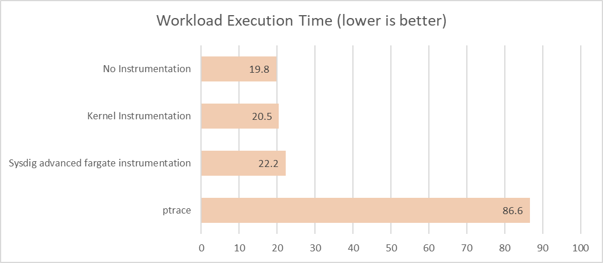

こんにちは [@jedipunkz](https://twitter.com/jedipunkz) 🚀 です。

ECS 構成をもう少しセキュアに保てる構成はないものだろうかと模索しているなかで Sysdig を見つけました。まだ導入できる目処は立っていないのですがある程度ノウハウ蓄積出来てきたのでここで検証内容等を記事にしようかと思っています。

Sysdig は幾つかのサービスが存在するのですが今回検証したのは Sysdig Serverless Security と呼ばれるモノで ECS Fargate 上のコンテナランタイムセキュリティを実践することができるサービスです。

## Sysdig とは
AWS のサービスにも脅威検知を行うことができるサービスが揃っているのはご存知と思います

| 対象 | 目的 | 技術・サービス |
|---|---|---|
| AWS リソース | 驚異検知 | AWS GuardDuty |

また予防の観点で脆弱性診断が出来るサービスもありあす

| 対象 | 目的 | 技術・サービス |
|---|---|---|
| AWS リソース | セキュリティ診断 | AWS Trusted Advisor |
| ECS コンテナ | 脆弱性診断 | ECR Image Scan |
| EC2 上のソフトウェア | 脆弱性診断 | AWS Inspector |


ここで気がつくと思うのですがコンテナ上の驚異検知を行うサービスが AWS には無いと思っています。 (2022/09 時点)

Sysdig Serverless Security は ECS Fargate コンテナ上の脅威検知を行うサービスです。ECS Fargate 利用時にコンテナ上の脅威検知を行うサービスは他にも幾つかありますが、Sysdig はシステムコールを利用したコンテナランタイムセキュリティを実践して脅威検知・通知が行えるものになります。自分も詳しくないのですがこれを CWPP (Cloud Workload Protection Platform) と言うらしいです。ワークロードというのはクラウド上の仮想マシン・稼働中のソフトウェアを指して、CWPP はマルウェア保護、脆弱性スキャン、アクセス制御、異常検知の機能を使用してそれぞれのワークロードを保護する、ということらしいです。

### Sysdig 以外の CWPP はどういうものがあるのか?

Sysdig 以外ですと代表するものが下記になるそうです。

- [Datadog](https://www.datadoghq.com/ja/blog/tag/cwpp/)
- [Aqua CWWP](https://www.creationline.com/aqua/cwpp)
- [Palo Alto Prisma](https://docs.paloaltonetworks.com/prisma/prisma-cloud/prisma-cloud-admin-compute/runtime_defense/fargate)

### Sysdig をもう少し具体的に説明

Sysdig は CNCF の [Falco](https://falco.org/ja/) をベースとして脅威検出を行うための SaaS を含めたシステムとなります。コンテナ上の脅威と共にクラウドアカウントを紐付けることでクラウド自体のセキュリティチェックを行うことも出来ます。たとえば問題のある S3 バケット公開設定や、IAM の権限に関するものなど。今回自分は前者のコンテナ上の脅威検知について調べましたので、この記事でもそれについて記そうと思います。

### パフォーマンス

ベースとなっている Falco では Linux カーネルの ptrace システムコールを用いて脅威検知 (ファイルの読み書きやディスクへのアクセス・ネットワーク確立、ネットワークデータ送受信などについて) します。ですが ptrace はコンテナの本来のパフォーマンスに結構な影響があるそうです。それに比較して Sysdig はワークロードセキュリティを実装していないコンテナとほぼ同等のパフォーマンスが出ているように見えます。

参考資料: [Sysdig Blog](https://sysdig.com/blog/aws-fargate-runtime-security-ptrace-ld_preload/)



## Sysdig + ECS Fargate の構成

ここから具体的に検証した内容を記していきたいと思います。

自分は ECS Fargate を用いた Sysdig 利用を前提にして構成を組みました。

構成の特徴としては下記になります。

- 2エージェント構成
  - Sysdig サーバレス・オーケストレーター・エージェント
  - Sysdig サーバーレス・ワークロード・エージェント
- 2つとも ECS Fargate 上に起動
- タスク定義毎にワークロードエージェントが起動しプロキシ的に動作するオーケストレーター・エージェントと通信
- オーケストレーター・エージェントはワークロード・エージェントからのデータを収集して Sysdig バックエンドへ転送する役割

下記が構成図になります。

参考: https://docs.sysdig.com/en/docs/installation/serverless-agents/aws-fargate-serverless-agents/


## 構築

### Sysdig Region 情報

下記のドキュメントにある通り Sysdig には利用者が意識すべき Region という概念があります。どの Region を用いるか決定し、エンドポイント情報を構築の事前に収集する必要があります。

- 参考: https://docs.sysdig.com/en/docs/administration/saas-regions-and-ip-ranges

### Sysdig サーバレス・オーケストレーター・エージェントの構築

下記の Sysdig 公式の Terraform Module を用いる事で構築することが可能です。

- 参考: https://github.com/sysdiglabs/terraform-aws-fargate-orchestrator-agent

下記が検証目的で作成した Terraform コードです。

```hcl
module "sysdig_orchestrator_agent" {
  source  = "sysdiglabs/fargate-orchestrator-agent/aws"
  version = "0.2.0"

  name = "example-sysdigorchestrator"

  vpc_id = var.vpc_id
  subnets = [
    aws_subnet.example1.id,
    aws_subnet.example2.id,
  ]
  access_key       = var.my_sysdig_access_key
  collector_host   = "ingest-us2.app.sysdig.com" # 定めたリージョンのコレクタホストアドレス
  collector_port   = "6443"
  agent_image      = "quay.io/sysdig/orchestrator-agent:latest"
  assign_public_ip = false # Internet Gateway を用いる場合は true を指定
}
```

### Sysdig サーバレス・ワークロード・エージェントを盛り込んだアプリケーションコンテナの構築

検証では Sysdig 公式の Terraform Provider を用いて ECS タスク定義をレンダリングした。下記がその際のコードとなります。

```hcl
data "sysdig_fargate_workload_agent" "sysdig" {
  container_definitions = file("container_definitions/sysdigapp.json")

  sysdig_access_key = var.my_sysdig_access_key

  workload_agent_image = "quay.io/sysdig/workload-agent:latest"

  orchestrator_host = module.sysdig_orchestrator_agent.orchestrator_host
  orchestrator_port = module.sysdig_orchestrator_agent.orchestrator_port
}

resource "aws_ecs_task_definition" "sysdig" {
  family                   = "example-sysdigapp-taskdef"
  cpu                      = "2048"
  memory                   = "8192"
  network_mode             = "awsvpc"
  requires_compatibilities = ["FARGATE"]
  execution_role_arn       = aws_iam_role.task_exec.arn
  task_role_arn            = aws_iam_role.task.arn
  container_definitions    = data.sysdig_fargate_workload_agent.sysdig.output_container_definitions
}
```

尚、Sysdig Provider を用いてタスク定義をレンダリングしていますが、手動でもタスク定義を記すことが可能だそうです。その際には下記の処理をタスク定義に施すことで要件を満たせるそうです。

- Sysdig に関する環境変数
- Volume マウント指定
- capabilities 指定
- Sysdig コンテナ指定

### 構築後の Sysdig UI へのアクセス

構築後、(US-West を利用した場合は) 下記の URL で Sysdig Secure UI にアクセス出来ます。

https://us2.app.sysdig.com/secure/#/policies

## イベント検知

### ポリシーの種別

イベント検知のためのポリシーが用意されていて幾つかあるのですが ECS Fargate という条件であれば下記の2つの利用が可能だそうです。

- Workload Policy (Powered By Falco)
- List Maching Policy

下記は Kubernetes 前提だそうです。

- Container Drift Policy
- Machine Learning Policy

下記はコンテナセキュリティとは別枠 Policy で前述したクラウドアカウントを Sysdig に紐付けた際に利用できるポリシーです。

- Kubernetes Audit Policy
- AWS CloudTrail Policy
- GCP Audit Log Policy
- Azure Platform Log Policy

### List Maching Policy における
#### 特定ポートのリスン検知

下記の Rule を作成して Policy にアタッチすることでイベント検知出来ます。 また Policy アクションとして kill, stop, pause, nothing(notify only) が選べます。脅威を検知した際にプロセスの停止などが行えるということになります。

| 設定パラメータ名 | 値 |
|--|--|
| allInbounds | Deny |
| allOutbounds | Deny |
| udpListenPortsMatchItems | true |
| tcpListenPortsMatchItems | true |
| udpListenPorts | 8080 |
| tcpListenPorts | 8080 |

#### 特定ファイルの読み込み検知

下記の Rule を作成して Policy にアタッチすることでイベント検知出来ます。
また同様に Policy アクションとして kill, stop, pause, nothing(notify only) が選べます。

| 設定パラメータ名 | 値 |
|--|--|
| readPathsMatchItems | true |
| readPaths | <ファイルのパス> |
| readWritePathsMatchItems | false |

### Workload Policy

#### 特定プロセスの起動

下記の Rule を作成して Policy にアタッチすることで特定のプロセスが特定のオプションを用いて起動されているかどうかを検知出来ます。

| 設定パラメータ名 | 値 |
|--|--|
| condition | user.name = "nginx" and proc.name = "nginx" |
| output | 任意の情報を出力 |

動作確認した際の system call の情報は下記になるのでこれらを `condition` に記せば検知されることになります。

> (user.name=nginx user.loginuid=-1 proc.cmdline=nginx container.id=1e2a2f03e1934a719d98c45276ea57eb-265927825 container_name=web evt.type=accept evt.res=<NA> proc.pid=76 proc.cwd=/ proc.ppid=39 proc.pcmdline=nginx -g daemon off; proc.sid=15 proc.exepath=/usr/sbin/nginx user.uid=101 user.loginname=<NA> group.gid=101 group.name=nginx container.name=web image=nginx:latest)

### ベストプラクティス的な Policy 設定

上記のように個別に Policy, Rule を定義しても、漏れが発生・想定外が発生するので、Sysdig が Managed Rules, Policies を用意してくれています。少なくとも下記を有効化することで大抵の脅威検知は可能だそうです。

Sysdig Runtime Threat Detection (Workload Policy)

> This policy contains rules which Sysdig considers High Confidence of a security incident. They are tightly coupled to common attacker TTP's. They have been designed to minimize false positives but may still result in some depending on your environment.

Sysdig Runtime Threat Intelligence (Workload Policy)

> This policy contains rules using Indicators of Compromise curated by the Sysdig Threat Intelligence Team from premium, OSINT, and custom threat intelligence feeds. Any events from the rules in this policy should be considered serious and investigated as soon as possible.

Sysdig Runtime Notable Events (Workload Policy)

> This Notable Events policy contains rules which may indicate undesired behavior including security threats. The rules are more generalized than Threat Detection policies and may result in more noise. Tuning will likely be required for the events generated from this policy.


## コスト

[AWS Marketplae](https://aws.amazon.com/marketplace/pp/prodview-dq475uhgg4o6g?sr=0-4&ref_=beagle&applicationId=AWSMPContessa) に `Sysdig Secure DevOps Platform` があり、Pricing が記載ありました。

| プラン名 | 1ヶ月コスト | 1年間コスト | 説明 |
|---|---|---|---|
| Secure Cloud Security | $500 | $5,000 | CloudTrail 連携など |
| Secure Enterprise CaaS | $12/task | $120/task | Container Runtime Security |

## まとめ

Terraform Sysdig Provider が用意されているので、自分たちの環境に取っ付き易い構築方法を取ることが出来ました。オーケストレーターエージェントは Module を使えば簡単に構築可能。外部と通信させるのですが VPC 内部に置くことも可能。ワークロードエージェントも Terraform で容易に構築可能。タスク定義のレンダリングを Terraform 以外の技術を使って行っている場合でも4つほどの要件を予め満たしておけば比較的簡単に Sysdig を適用したコンテナが起動可能です。今回はパフォーマンスは測定出来ていませんが、公式ブログの情報を信じると ptrace に比べてパフォーマンス低下は気にする必要なくなりそうです。ここは有償版だなという印象。

また、構築したアプリケーションコンテナ (例で Nginx) の中を除いてみると下記のようなプロセスが稼働していました。

```shell
# ps auxf (一分情報を抜粋)
/dev/init -- /opt/draios/bin/instrument /docker-entrypoint.sh nginx -g daemon off;
/opt/draios/bin/instrument /docker-entrypoint.sh nginx -g daemon off;
 \_ /opt/draios/bin/agentino --name=ip-10-0-65-79.ap-northeast-1.compute.internal --aws-account-id=395127550274 --aws-region=ap-north
east-1 --aws-az=ap-northeast-1a --aws-fargate-cluster-arn=arn
 \_ /opt/draios/bin/pdig -C -t -1 -l /opt/draios/bin/libudigembed.so /docker-entrypoint.sh nginx -g daemon off;
     \_ nginx: master process nginx -g daemon off;
         \_ nginx: worker process
         \_ nginx: worker process
<snip>
```

コンテナプロセスが `/opt/draios/bin/instrument` というコマンドの引数に渡されていました。更にサイドカーで起動している Instrument コンテナのボリューム領域をアプリケーションコンテナがマウントしているのが判りました。

また、注意点があります。ECS Exec を用いてコンテナにログインしてもイベント検知の動作確認としての操作を行っても検知してくれませんでした。Policy を独自に作成した際に不便なのですが、動作確認のためにはコンテナ上で sshd を起動するか、タスク定義のエントリポイント指定を書き換えて行う必要があるそうです。ただ、Sysdig 社でも ECS Exec でログインした際の操作に関しても検知範囲にするための開発を予定しているそうです。ECS Exec は IAM の権限があればログイン出来てしまうもので、比較的セキュリティには気を使う機能だと思っているので Sysdig でログイン後の操作を検知出来るようになるのは助かりますし、期待したいところです。
