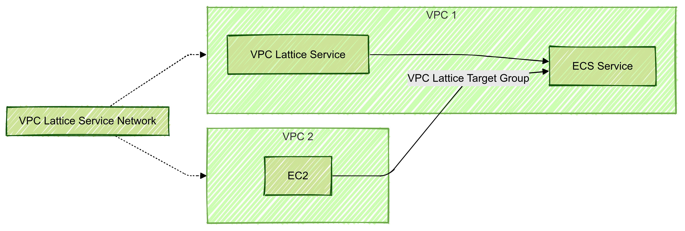

jedipunkz です。VPC Lattice が ECS に対応したという情報が https://aws.amazon.com/jp/about-aws/whats-new/2024/11/amazon-vpc-lattice-elastic-container-service/ にあがりました。この対応を Terraform を使って構成して検証してみるのが今回の目的になります。

## 今回検証で用いたコード

検証コードは下記に置いておきました。
https://github.com/jedipunkz/vpclattice-ecs-playground

## 概要

構成の概要としては下記です。(Mermaid 記表でうまく描けていませんが)

- VPC1, VPC2 に跨る形で VPC Lattice Service Network が配置
- VPC2 上の何者か (例で EC2) が VPC1 上の ECS に接続可能
- その際は VPC Service Network を介して VPC Lattice Service がエンドポイントとして受ける (うまく描けてない)

という事は今まで複数の VPC 間で ECS のエンドポイントを共有しようとすると

- VPC1, VPC2 とで VPC Peering を張る
- VPC1 上の Private Subnets 上で ALB を構築して ECS Service に接続する

という構成が必要でしたが、VPC Lattice を使えばそれらが不要になる、という事です。



## 今回検証した構成

今回使った Terraform コードで構築した構成は下記です。各 AWS リソースの関係図になっています。
特徴としては

- ECS 構成は Cluster, Service ,Task の通常の構成
- ECS Service に ALB ではなく VPC Lattice Target Group が紐づいている
- VPC Lattice Listner が VPC Lattice Service と VPC Lattice Target Group を紐づけている
- VPC Lattice Listner はリクエストを VPC Lattice Target Group に転送
- なおかつ VPC Lattice Listener にはヘルスチェック機能がある


## Terraform コードを見て把握する

構成を理解するために各リソースの紐づけの指定を観点にコードを見ていきます。

### ECS と VPC Lattice Target Group の紐づけ

ECS Service のパラメータです。通常は ALB を接続するパラメータを書くと思うのですが、VPC Lattice の場合は `vpc_lattice_configrations` となります。

```hcl
  vpc_lattice_configurations {
    role_arn         = aws_iam_role.ecs_infrastructure.arn
    target_group_arn = aws_vpclattice_target_group.main.arn
    port_name        = "web-80-tcp"
  }
```

###  VPC Lattice Listener の VPC Lattice Service, VPC Lattice Target Group の紐づけ


VPC Lattice Listener が VPC Lattice Service と VPC Lattice Target Group を紐づけている記述が下記になります。
つまりエンドポイントである VPC Lattice Service が Listener, VPC Lattice Target Group を介して ECS Service に接続している、という事です。

```hcl
resource "aws_vpclattice_listener" "main" {
  name               = "http-80"
  port               = 80
  protocol           = "HTTP"
  service_arn        = aws_vpclattice_service.main.arn
  service_identifier = aws_vpclattice_service.main.id
  default_action {
    forward {
      target_groups {
        target_group_identifier = aws_vpclattice_target_group.main.id
        weight                  = 1
      }
    }
  }
}
```

### VPC Lattice Service Network と VPC Lattice Service の紐づけ

下記のような記述で VPC Lattice Service Network と VPC Latice Serivce が紐づいています。

```hcl
resource "aws_vpclattice_service_network_service_association" "service_association" {
  service_network_identifier = aws_vpclattice_service_network.main.id
  service_identifier         = aws_vpclattice_service.main.id
}
```

### VPC と VPC Lattice Service Network の紐づけ

VPC と VPC Lattice Service Network が紐づいています。またセキュリティグループが設定されていて、VPC Lattice Service Network への通信が制御できるようになっています。

```hcl
resource "aws_vpclattice_service_network_vpc_association" "vpc_association" {
  security_group_ids         = [aws_security_group.lattice_service_network.id]
  service_network_identifier = aws_vpclattice_service_network.main.id
  vpc_identifier             = module.vpc.vpc_id
}
```

## 考察
### 導入メリットの観点
複数の VPC 間で ECS Serivce のエンドポイントを接続出来るのはメリットだと思います。またロードバランサが不要になったことも大きいです。ただご存知のように ALB は内部ノードが拡張することでスケールアウトするのですが VPC Lattice Service も拡張性を備えているのかは気になります。

### パブリックにエンドポイントを出せるのかの観点
また今回は Private Subnet 上で構成しました。確かに VPC 上に EC2 等を起動して VPC Lattice Service のエンドポイントに curl を使ってアクセス出来ましたが、この構成が Public Subnet 上に展開出来るのかはまだ自分は分かっていません。軽く Public Subnet を指定して構築してみましたが外部から curl で VPC Lattice Service に接続出来ませんでした。DNS 的な問題が現れました。また ECS Service は Subnet の指定をしていますが Lattice 関連のリソースはサブネットの指定箇所が無いことに気が付きます。(もしかすると Terraform Document 等呼んでいくと指定箇所があるのかもしれないですが)。ですが VPC に跨る形で配置される Lattice の特徴を考えると出来ない気もします。このあたりは引き続き調査します。

## 備考
### aws コンソールの問題

ちょうど先週発表された機能なので仕方ないのですが現時点では aws コンソールの機能に不十分な点が見受けられました (2024/11時点)

- ECS Service の VPC Lattice の設定画面で VPC を選択する事ができるがセキュリティグループを選択できないので default セキュリティグループになってしまう
- ECS Service の VPC Lattice の設定画面で一度設定した Lattice Target Group を削除して保存。その後、同じ画面で既存の Lattice Target Group を選択出来ないので新たに作らなくてはいけない

### Terraform 検証にあたり注意点

手順を間違うと eni が削除出来ない問題に遭遇すると思います。`terraform destroy` すると下記のリソースが主に残ります。おそらく Terraform AWS Provider の不具合な気はしていますが確認したところ Issue には問題がありませんでした。新しい不具合な可能性もあります。この時点で aws コンソールで順にリソースを削除しようと考えると思うのですが ECS Cluster を削除しても ECS Service の Attacment? リソースが残り、結果 eni が消せません。eni が消せないので IGW, Subnet, VPC も消せない、という状況になります。

- VPC
- Subnet
- IGW
- ECS Cluster
- ECS Service
